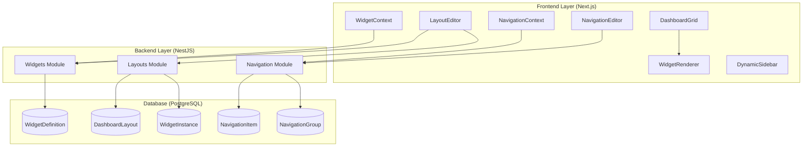
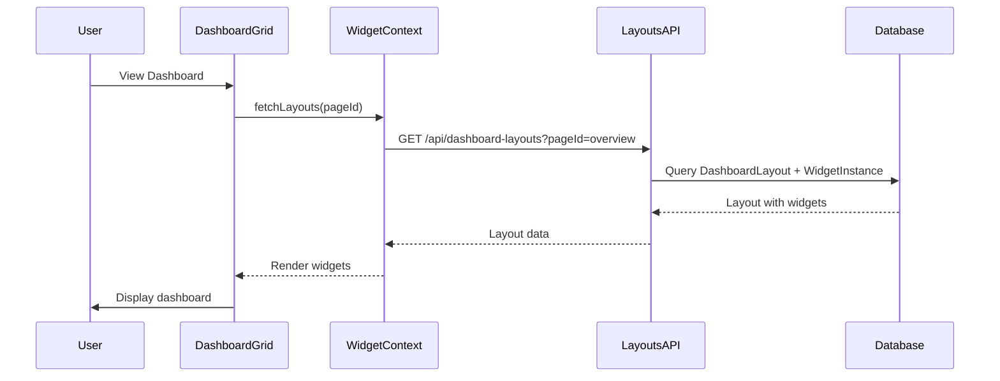

# Design Document

## Overview

The Dashboard Customization System provides a modular, AI-agent-friendly solution for dynamic dashboard composition and navigation management. The system consists of two integrated but independent subsystems:

1. **Widget Layout System**: Enables dynamic dashboard page composition from reusable widget components with database-stored layouts
2. **Navigation Management System**: Provides database-driven sidebar menu configuration with hierarchical structure

Both systems are designed to work together seamlessly while remaining independently functional, allowing gradual adoption and flexible implementation.

### Key Design Principles

- **Modular Architecture**: Widget and navigation systems can be implemented independently
- **AI Discoverability**: Structured APIs and metadata enable AI agents to understand and modify the system
- **Backward Compatibility**: Existing hardcoded navigation and static pages continue working
- **Database-Driven**: All configuration stored in PostgreSQL for dynamic updates
- **Permission-Integrated**: Leverages existing JWT permission system
- **Type-Safe**: Comprehensive TypeScript types throughout
- **Performance-Optimized**: Caching, lazy loading, and memoization strategies

## Architecture

### System Architecture Diagram



### Data Flow




## Components and Interfaces

### Database Schema

#### WidgetDefinition Table

Stores metadata for all available widget components.

```prisma
model WidgetDefinition {
  id                String            @id @default(cuid())
  key               String            @unique // e.g., "revenue-chart"
  name              String            // e.g., "Revenue Chart"
  description       String
  component         String            // Component file name
  category          String            // analytics, ecommerce, users, content, system
  icon              String            // Lucide icon name
  defaultGridSpan   Int               @default(6) @map("default_grid_span")
  minGridSpan       Int               @default(3) @map("min_grid_span")
  maxGridSpan       Int               @default(12) @map("max_grid_span")
  configSchema      Json              @map("config_schema") // JSON Schema
  dataRequirements  Json              @map("data_requirements") // API endpoints, permissions
  isActive          Boolean           @default(true) @map("is_active")
  isSystemWidget    Boolean           @default(false) @map("is_system_widget")
  createdAt         DateTime          @default(now()) @map("created_at")
  updatedAt         DateTime          @updatedAt @map("updated_at")
  
  widgetInstances   WidgetInstance[]
  
  @@index([key])
  @@index([category])
  @@index([isActive])
  @@map("widget_definitions")
}
```

#### DashboardLayout Table

Stores widget arrangements per page and user.

```prisma
model DashboardLayout {
  id          String           @id @default(cuid())
  pageId      String           @map("page_id") // e.g., "overview", "analytics"
  userId      String?          @map("user_id") // null for global layouts
  scope       String           @default("global") // "global" or "user"
  name        String
  description String?
  widgets     Json             // Array of widget configurations
  isActive    Boolean          @default(true) @map("is_active")
  isDefault   Boolean          @default(false) @map("is_default")
  createdAt   DateTime         @default(now()) @map("created_at")
  updatedAt   DateTime         @updatedAt @map("updated_at")
  
  user            User?            @relation(fields: [userId], references: [id], onDelete: Cascade)
  widgetInstances WidgetInstance[]
  
  @@unique([pageId, userId])
  @@index([pageId])
  @@index([userId])
  @@index([scope])
  @@index([isDefault])
  @@map("dashboard_layouts")
}
```

#### WidgetInstance Table

Stores individual widget placements with configuration.

```prisma
model WidgetInstance {
  id        String    @id @default(cuid())
  layoutId  String    @map("layout_id")
  widgetKey String    @map("widget_key")
  position  Int       // Order in layout
  gridSpan  Int       @default(6) @map("grid_span")
  gridRow   Int?      @map("grid_row")
  config    Json      // Widget-specific configuration
  isVisible Boolean   @default(true) @map("is_visible")
  createdAt DateTime  @default(now()) @map("created_at")
  updatedAt DateTime  @updatedAt @map("updated_at")
  
  layout           DashboardLayout  @relation(fields: [layoutId], references: [id], onDelete: Cascade)
  widgetDefinition WidgetDefinition @relation(fields: [widgetKey], references: [key])
  
  @@index([layoutId])
  @@index([widgetKey])
  @@index([position])
  @@map("widget_instances")
}
```


#### NavigationItem Table

Stores database-driven menu items with hierarchical support.

```prisma
model NavigationItem {
  id           String             @id @default(cuid())
  key          String             @unique // e.g., "dashboard-overview"
  title        String             // Display text
  href         String             // Route path
  icon         String             // Lucide icon name
  description  String?
  permission   String?            // Required permission (nullable)
  badge        String?            // Badge text/count
  position     Int                // Order within parent
  isEnabled    Boolean            @default(true) @map("is_enabled")
  isVisible    Boolean            @default(true) @map("is_visible")
  isSystemItem Boolean            @default(false) @map("is_system_item")
  parentId     String?            @map("parent_id")
  createdAt    DateTime           @default(now()) @map("created_at")
  updatedAt    DateTime           @updatedAt @map("updated_at")
  
  parent   NavigationItem?  @relation("NavigationHierarchy", fields: [parentId], references: [id], onDelete: Cascade)
  children NavigationItem[] @relation("NavigationHierarchy")
  groups   NavigationItemGroup[]
  
  @@index([key])
  @@index([parentId])
  @@index([position])
  @@index([isEnabled])
  @@map("navigation_items")
}
```

#### NavigationGroup Table

Organizes navigation items into collapsible sections.

```prisma
model NavigationGroup {
  id             String                @id @default(cuid())
  key            String                @unique
  title          String
  description    String?
  icon           String?
  position       Int
  isCollapsible  Boolean               @default(true) @map("is_collapsible")
  isDefaultOpen  Boolean               @default(true) @map("is_default_open")
  isEnabled      Boolean               @default(true) @map("is_enabled")
  createdAt      DateTime              @default(now()) @map("created_at")
  updatedAt      DateTime              @updatedAt @map("updated_at")
  
  items NavigationItemGroup[]
  
  @@index([key])
  @@index([position])
  @@index([isEnabled])
  @@map("navigation_groups")
}
```

#### NavigationItemGroup Junction Table

Many-to-many relationship between items and groups.

```prisma
model NavigationItemGroup {
  id               String          @id @default(cuid())
  navigationItemId String          @map("navigation_item_id")
  navigationGroupId String         @map("navigation_group_id")
  position         Int
  createdAt        DateTime        @default(now()) @map("created_at")
  
  navigationItem  NavigationItem  @relation(fields: [navigationItemId], references: [id], onDelete: Cascade)
  navigationGroup NavigationGroup @relation(fields: [navigationGroupId], references: [id], onDelete: Cascade)
  
  @@unique([navigationItemId, navigationGroupId])
  @@index([navigationItemId])
  @@index([navigationGroupId])
  @@map("navigation_item_groups")
}
```


### Backend API Design

#### Widgets Module

**Endpoints:**

```typescript
// Widget Registry
GET    /api/widgets/registry                    // List all widgets
GET    /api/widgets/registry/:key               // Get specific widget
POST   /api/widgets/registry                    // Register new widget (admin)
PATCH  /api/widgets/registry/:key               // Update widget (admin)
DELETE /api/widgets/registry/:key               // Remove widget (admin)
GET    /api/widgets/registry/categories         // List categories
GET    /api/widgets/registry/search?query=:term // Search widgets
```

**Service Methods:**

```typescript
class WidgetRegistryService {
  async findAll(filters?: WidgetFilters): Promise<WidgetDefinition[]>
  async findByKey(key: string): Promise<WidgetDefinition>
  async create(dto: CreateWidgetDto): Promise<WidgetDefinition>
  async update(key: string, dto: UpdateWidgetDto): Promise<WidgetDefinition>
  async remove(key: string): Promise<void>
  async searchByCapability(query: string): Promise<WidgetDefinition[]>
  async getCategories(): Promise<string[]>
  async filterByPermissions(widgets: WidgetDefinition[], user: User): Promise<WidgetDefinition[]>
}
```

#### Layouts Module

**Endpoints:**

```typescript
// Dashboard Layouts
GET    /api/dashboard-layouts                   // List layouts
GET    /api/dashboard-layouts/:pageId           // Get layout for page
POST   /api/dashboard-layouts                   // Create layout
PATCH  /api/dashboard-layouts/:id               // Update layout
DELETE /api/dashboard-layouts/:id               // Delete layout
POST   /api/dashboard-layouts/:id/clone         // Clone layout
POST   /api/dashboard-layouts/reset             // Reset to default
GET    /api/dashboard-layouts/templates         // List templates

// Widget Instances
POST   /api/dashboard-layouts/:id/widgets       // Add widget
DELETE /api/dashboard-layouts/:layoutId/widgets/:widgetId  // Remove widget
PATCH  /api/dashboard-layouts/:id/widgets/reorder  // Reorder widgets
```

**Service Methods:**

```typescript
class DashboardLayoutsService {
  async findAll(userId?: string, scope?: string): Promise<DashboardLayout[]>
  async findByPageId(pageId: string, userId?: string): Promise<DashboardLayout>
  async create(dto: CreateLayoutDto): Promise<DashboardLayout>
  async update(id: string, dto: UpdateLayoutDto): Promise<DashboardLayout>
  async remove(id: string): Promise<void>
  async clone(id: string, name: string): Promise<DashboardLayout>
  async resetToDefault(pageId: string, userId?: string): Promise<DashboardLayout>
  async getTemplates(): Promise<LayoutTemplate[]>
  async addWidget(layoutId: string, dto: AddWidgetDto): Promise<WidgetInstance>
  async removeWidget(layoutId: string, widgetId: string): Promise<void>
  async reorderWidgets(layoutId: string, dto: ReorderWidgetsDto): Promise<DashboardLayout>
}
```

#### Navigation Module

**Endpoints:**

```typescript
// Navigation Items
GET    /api/navigation/items                    // List all items
GET    /api/navigation/tree                     // Get hierarchical tree
POST   /api/navigation/items                    // Create item (admin)
PATCH  /api/navigation/items/:id                // Update item (admin)
DELETE /api/navigation/items/:id                // Delete item (admin)
POST   /api/navigation/items/reorder            // Bulk reorder (admin)

// Navigation Groups
GET    /api/navigation/groups                   // List groups
POST   /api/navigation/groups                   // Create group (admin)
PATCH  /api/navigation/groups/:id               // Update group (admin)
DELETE /api/navigation/groups/:id               // Delete group (admin)
```

**Service Methods:**

```typescript
class NavigationService {
  async findAll(filters?: NavigationFilters): Promise<NavigationItem[]>
  async findById(id: string): Promise<NavigationItem>
  async create(dto: CreateNavigationItemDto): Promise<NavigationItem>
  async update(id: string, dto: UpdateNavigationItemDto): Promise<NavigationItem>
  async remove(id: string): Promise<void>
  async reorder(dto: ReorderItemsDto): Promise<void>
  async filterByPermissions(items: NavigationItem[], user: User): Promise<NavigationItem[]>
}

class NavigationBuilderService {
  async buildTree(userId?: string): Promise<NavigationTreeNode[]>
  async buildFlatList(userId?: string): Promise<NavigationItem[]>
  async validateHierarchy(items: NavigationItem[]): boolean
  async detectCircularReferences(items: NavigationItem[]): boolean
}
```


### Frontend Architecture

#### Widget Registry (Frontend)

Maps widget keys to React components for dynamic rendering.

```typescript
// frontend/src/lib/widget-registry.ts
import { lazy, ComponentType } from 'react';

export interface WidgetRegistryEntry {
  component: ComponentType<any>;
  defaultProps?: Record<string, any>;
  propTypes?: Record<string, any>;
  category: string;
  lazy?: boolean;
}

export const widgetRegistry: Record<string, WidgetRegistryEntry> = {
  'revenue-chart': {
    component: lazy(() => import('@/components/widgets/core/ChartWidget')),
    defaultProps: { type: 'line', height: 300 },
    category: 'analytics',
    lazy: true,
  },
  'stats-card': {
    component: () => import('@/components/widgets/core/StatsCard'),
    category: 'core',
    lazy: false,
  },
  'data-table': {
    component: lazy(() => import('@/components/widgets/core/DataTable')),
    category: 'data-display',
    lazy: true,
  },
  // ... more widgets
};

export function getWidgetComponent(key: string): ComponentType<any> | null {
  const entry = widgetRegistry[key];
  return entry?.component || null;
}

export function getWidgetsByCategory(category: string): string[] {
  return Object.entries(widgetRegistry)
    .filter(([_, entry]) => entry.category === category)
    .map(([key]) => key);
}
```

#### WidgetContext

Global state management for widget layouts.

```typescript
// frontend/src/contexts/WidgetContext.tsx
import { createContext, useContext, useState, useEffect } from 'react';

interface WidgetContextValue {
  layouts: DashboardLayout[];
  currentLayout: DashboardLayout | null;
  isLoading: boolean;
  isEditMode: boolean;
  fetchLayouts: (pageId?: string) => Promise<void>;
  updateLayout: (id: string, data: Partial<DashboardLayout>) => Promise<void>;
  addWidget: (layoutId: string, widgetKey: string, config?: any) => Promise<void>;
  removeWidget: (layoutId: string, widgetId: string) => Promise<void>;
  reorderWidgets: (layoutId: string, widgetIds: string[]) => Promise<void>;
  toggleEditMode: () => void;
}

const WidgetContext = createContext<WidgetContextValue | undefined>(undefined);

export function WidgetProvider({ children }: { children: React.ReactNode }) {
  const [layouts, setLayouts] = useState<DashboardLayout[]>([]);
  const [currentLayout, setCurrentLayout] = useState<DashboardLayout | null>(null);
  const [isLoading, setIsLoading] = useState(false);
  const [isEditMode, setIsEditMode] = useState(false);
  
  const fetchLayouts = async (pageId?: string) => {
    setIsLoading(true);
    try {
      const response = await fetch(`/api/dashboard-layouts${pageId ? `?pageId=${pageId}` : ''}`);
      const data = await response.json();
      setLayouts(data);
      if (pageId && data.length > 0) {
        setCurrentLayout(data[0]);
      }
    } finally {
      setIsLoading(false);
    }
  };
  
  const addWidget = async (layoutId: string, widgetKey: string, config?: any) => {
    const response = await fetch(`/api/dashboard-layouts/${layoutId}/widgets`, {
      method: 'POST',
      headers: { 'Content-Type': 'application/json' },
      body: JSON.stringify({ widgetKey, config }),
    });
    const newWidget = await response.json();
    
    // Optimistic update
    setCurrentLayout(prev => {
      if (!prev) return prev;
      return {
        ...prev,
        widgetInstances: [...(prev.widgetInstances || []), newWidget],
      };
    });
  };
  
  // ... other methods
  
  return (
    <WidgetContext.Provider value={{
      layouts,
      currentLayout,
      isLoading,
      isEditMode,
      fetchLayouts,
      updateLayout,
      addWidget,
      removeWidget,
      reorderWidgets,
      toggleEditMode,
    }}>
      {children}
    </WidgetContext.Provider>
  );
}

export function useWidgets() {
  const context = useContext(WidgetContext);
  if (!context) {
    throw new Error('useWidgets must be used within WidgetProvider');
  }
  return context;
}
```


#### DashboardGrid Component

Renders widgets in a responsive CSS Grid layout.

```typescript
// frontend/src/components/dashboard/DashboardGrid.tsx
import { useWidgets } from '@/contexts/WidgetContext';
import { WidgetRenderer } from './WidgetRenderer';
import { DndContext, closestCenter } from '@dnd-kit/core';
import { SortableContext, verticalListSortingStrategy } from '@dnd-kit/sortable';

export function DashboardGrid({ pageId }: { pageId: string }) {
  const { currentLayout, isEditMode, reorderWidgets } = useWidgets();
  
  const handleDragEnd = (event: any) => {
    const { active, over } = event;
    if (active.id !== over.id && currentLayout) {
      const oldIndex = currentLayout.widgetInstances.findIndex(w => w.id === active.id);
      const newIndex = currentLayout.widgetInstances.findIndex(w => w.id === over.id);
      
      const newOrder = arrayMove(currentLayout.widgetInstances, oldIndex, newIndex);
      reorderWidgets(currentLayout.id, newOrder.map(w => w.id));
    }
  };
  
  if (!currentLayout) {
    return <div>Loading...</div>;
  }
  
  return (
    <DndContext collisionDetection={closestCenter} onDragEnd={handleDragEnd}>
      <SortableContext
        items={currentLayout.widgetInstances.map(w => w.id)}
        strategy={verticalListSortingStrategy}
        disabled={!isEditMode}
      >
        <div className="grid grid-cols-1 md:grid-cols-2 lg:grid-cols-12 gap-4">
          {currentLayout.widgetInstances.map((widget) => (
            <div
              key={widget.id}
              className={`col-span-1 lg:col-span-${widget.gridSpan}`}
              style={{ gridRow: widget.gridRow || 'auto' }}
            >
              <WidgetRenderer
                widgetKey={widget.widgetKey}
                config={widget.config}
                isEditMode={isEditMode}
                onRemove={() => removeWidget(currentLayout.id, widget.id)}
              />
            </div>
          ))}
        </div>
      </SortableContext>
    </DndContext>
  );
}
```

#### WidgetRenderer Component

Dynamically renders widgets from the registry.

```typescript
// frontend/src/components/dashboard/WidgetRenderer.tsx
import { Suspense } from 'react';
import { getWidgetComponent } from '@/lib/widget-registry';
import { SkeletonLoader } from '@/components/widgets/layout/SkeletonLoader';
import { ErrorBoundary } from '@/components/widgets/layout/ErrorBoundary';

interface WidgetRendererProps {
  widgetKey: string;
  config: any;
  isEditMode?: boolean;
  onRemove?: () => void;
}

export function WidgetRenderer({ widgetKey, config, isEditMode, onRemove }: WidgetRendererProps) {
  const WidgetComponent = getWidgetComponent(widgetKey);
  
  if (!WidgetComponent) {
    return (
      <div className="p-4 border border-destructive rounded-lg bg-destructive/10">
        <p className="text-destructive">Widget not found: {widgetKey}</p>
      </div>
    );
  }
  
  return (
    <ErrorBoundary>
      <Suspense fallback={<SkeletonLoader variant="card" />}>
        <div className="relative">
          {isEditMode && (
            <div className="absolute top-2 right-2 z-10 flex gap-2">
              <button
                onClick={onRemove}
                className="p-1 bg-destructive text-destructive-foreground rounded hover:bg-destructive/90"
                aria-label="Remove widget"
              >
                <X className="h-4 w-4" />
              </button>
            </div>
          )}
          <WidgetComponent {...config} />
        </div>
      </Suspense>
    </ErrorBoundary>
  );
}
```

