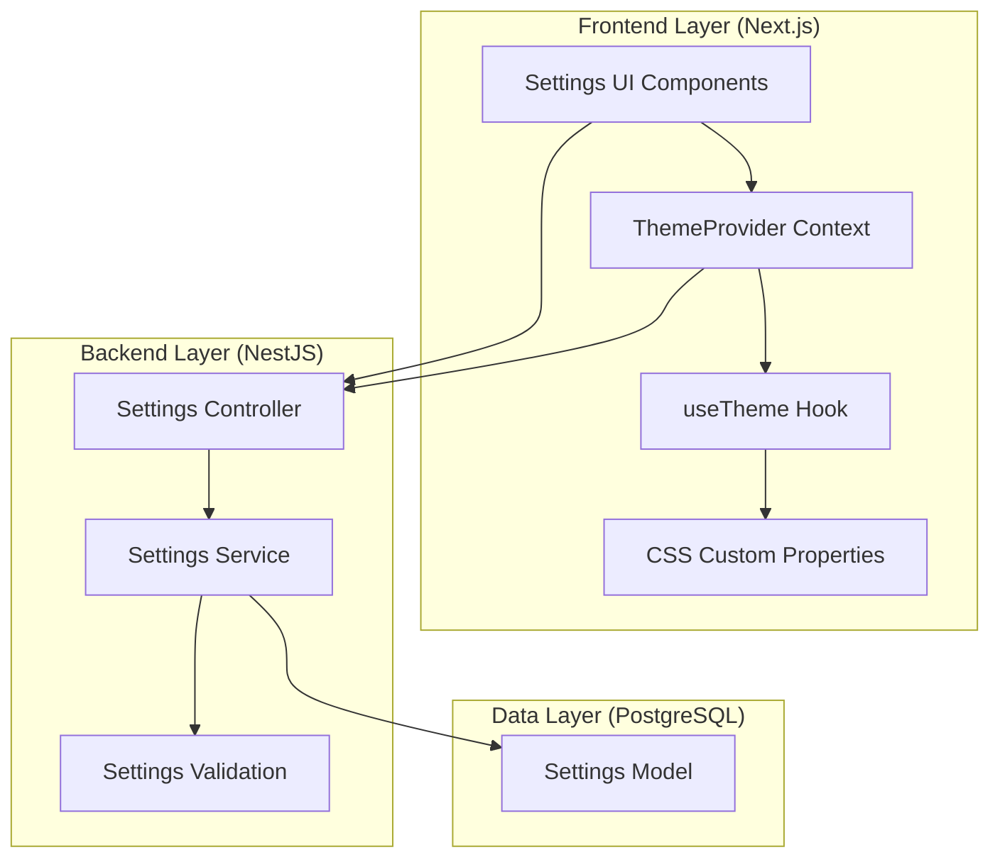

# Design Document

## Overview

The Design System Theming feature provides a comprehensive, modular approach to managing visual design across the full-stack application. The system architecture consists of three primary layers:

1. **Data Layer**: Prisma-based Settings model storing theme and typography configurations in PostgreSQL
2. **API Layer**: NestJS RESTful endpoints for CRUD operations on settings
3. **Presentation Layer**: Next.js React components with context-based theme management and CSS custom properties

The design leverages modern web standards including CSS custom properties for dynamic theming, OKLCH color space for perceptual uniformity, and React Context API for state management. The system is built to be extensible, performant, and accessible.

## Architecture

### System Architecture Diagram



### Data Flow

1. **Initial Load**: Application fetches settings from backend → ThemeProvider initializes → CSS variables applied
2. **Theme Toggle**: User clicks toggle → ThemeProvider updates state → CSS class updated → CSS variables switch
3. **Settings Update**: User modifies settings → Validation → API call → Database update → ThemeProvider refresh → CSS variables updated

## Components and Interfaces

### Database Schema

#### Settings Model (Prisma)

```prisma
model Settings {
  id                String   @id @default(cuid())
  userId            String?  @unique @map("user_id")
  scope             String   @default("global") // "global" or "user"
  
  // Theme Configuration
  themeMode         String   @default("system") @map("theme_mode") // "light", "dark", "system"
  activeTheme       String   @default("default") @map("active_theme")
  
  // Color Palette (stored as JSON)
  lightPalette      Json     @map("light_palette")
  darkPalette       Json     @map("dark_palette")
  
  // Typography Configuration (stored as JSON)
  typography        Json
  
  // Metadata
  createdAt         DateTime @default(now()) @map("created_at")
  updatedAt         DateTime @updatedAt @map("updated_at")
  
  @@map("settings")
}
```

### Backend Interfaces

#### Settings DTOs

```typescript
// create-settings.dto.ts
export class CreateSettingsDto {
  userId?: string;
  scope: 'global' | 'user';
  themeMode: 'light' | 'dark' | 'system';
  activeTheme: string;
  lightPalette: ColorPalette;
  darkPalette: ColorPalette;
  typography: TypographyConfig;
}

// update-settings.dto.ts
export class UpdateSettingsDto {
  themeMode?: 'light' | 'dark' | 'system';
  activeTheme?: string;
  lightPalette?: Partial<ColorPalette>;
  darkPalette?: Partial<ColorPalette>;
  typography?: Partial<TypographyConfig>;
}

// settings-response.dto.ts
export class SettingsResponseDto {
  id: string;
  userId?: string;
  scope: string;
  themeMode: string;
  activeTheme: string;
  lightPalette: ColorPalette;
  darkPalette: ColorPalette;
  typography: TypographyConfig;
  createdAt: Date;
  updatedAt: Date;
}
```

#### Color Palette Interface

```typescript
export interface ColorPalette {
  // Base colors
  background: string;      // OKLCH format
  foreground: string;
  
  // Component colors
  card: string;
  cardForeground: string;
  popover: string;
  popoverForeground: string;
  
  // Semantic colors
  primary: string;
  primaryForeground: string;
  secondary: string;
  secondaryForeground: string;
  muted: string;
  mutedForeground: string;
  accent: string;
  accentForeground: string;
  destructive: string;
  destructiveForeground: string;
  
  // UI elements
  border: string;
  input: string;
  ring: string;
  
  // Chart colors
  chart1: string;
  chart2: string;
  chart3: string;
  chart4: string;
  chart5: string;
  
  // Sidebar colors
  sidebar: string;
  sidebarForeground: string;
  sidebarPrimary: string;
  sidebarPrimaryForeground: string;
  sidebarAccent: string;
  sidebarAccentForeground: string;
  sidebarBorder: string;
  sidebarRing: string;
  
  // Radius
  radius: string;
}
```

#### Typography Configuration Interface

```typescript
export interface TypographyConfig {
  // Font families
  fontFamily: {
    sans: string[];
    serif: string[];
    mono: string[];
  };
  
  // Type scale (in rem)
  fontSize: {
    xs: string;
    sm: string;
    base: string;
    lg: string;
    xl: string;
    '2xl': string;
    '3xl': string;
    '4xl': string;
    '5xl': string;
    '6xl': string;
  };
  
  // Font weights
  fontWeight: {
    light: number;
    normal: number;
    medium: number;
    semibold: number;
    bold: number;
    extrabold: number;
  };
  
  // Line heights
  lineHeight: {
    tight: number;
    normal: number;
    relaxed: number;
    loose: number;
  };
  
  // Letter spacing
  letterSpacing: {
    tighter: string;
    tight: string;
    normal: string;
    wide: string;
    wider: string;
  };
}
```

### Frontend Interfaces

#### Theme Context Interface

```typescript
export interface ThemeContextValue {
  // Current state
  themeMode: 'light' | 'dark' | 'system';
  resolvedTheme: 'light' | 'dark';
  settings: SettingsResponseDto | null;
  isLoading: boolean;
  
  // Actions
  setThemeMode: (mode: 'light' | 'dark' | 'system') => void;
  updateColorPalette: (palette: Partial<ColorPalette>, mode: 'light' | 'dark') => Promise<void>;
  updateTypography: (typography: Partial<TypographyConfig>) => Promise<void>;
  resetToDefaults: () => Promise<void>;
  refreshSettings: () => Promise<void>;
}
```

#### Theme Provider Props

```typescript
export interface ThemeProviderProps {
  children: React.ReactNode;
  defaultTheme?: 'light' | 'dark' | 'system';
  storageKey?: string;
  userId?: string;
}
```

## Data Models

### Default Color Palettes

The system includes carefully crafted default palettes that meet WCAG AA accessibility standards:

**Light Mode Defaults** (using existing values from globals.css):
- Background: `oklch(1 0 0)` - Pure white
- Foreground: `oklch(0.145 0 0)` - Near black
- Primary: `oklch(0.205 0 0)` - Dark gray
- Accent: `oklch(0.97 0 0)` - Light gray

**Dark Mode Defaults**:
- Background: `oklch(0.145 0 0)` - Near black
- Foreground: `oklch(0.985 0 0)` - Near white
- Primary: `oklch(0.922 0 0)` - Light gray
- Accent: `oklch(0.269 0 0)` - Medium gray

### Default Typography Configuration

```typescript
const defaultTypography: TypographyConfig = {
  fontFamily: {
    sans: ['var(--font-geist-sans)', 'system-ui', 'sans-serif'],
    serif: ['Georgia', 'Cambria', 'Times New Roman', 'serif'],
    mono: ['var(--font-geist-mono)', 'Consolas', 'Monaco', 'monospace']
  },
  fontSize: {
    xs: '0.75rem',    // 12px
    sm: '0.875rem',   // 14px
    base: '1rem',     // 16px
    lg: '1.125rem',   // 18px
    xl: '1.25rem',    // 20px
    '2xl': '1.5rem',  // 24px
    '3xl': '1.875rem',// 30px
    '4xl': '2.25rem', // 36px
    '5xl': '3rem',    // 48px
    '6xl': '3.75rem'  // 60px
  },
  fontWeight: {
    light: 300,
    normal: 400,
    medium: 500,
    semibold: 600,
    bold: 700,
    extrabold: 800
  },
  lineHeight: {
    tight: 1.25,
    normal: 1.5,
    relaxed: 1.75,
    loose: 2
  },
  letterSpacing: {
    tighter: '-0.05em',
    tight: '-0.025em',
    normal: '0',
    wide: '0.025em',
    wider: '0.05em'
  }
};
```

## API Endpoints

### Settings Controller Routes

```typescript
// GET /api/settings
// Get current settings (global or user-specific)
@Get()
async getSettings(@Query('userId') userId?: string): Promise<SettingsResponseDto>

// POST /api/settings
// Create new settings configuration
@Post()
async createSettings(@Body() dto: CreateSettingsDto): Promise<SettingsResponseDto>

// PATCH /api/settings/:id
// Update existing settings
@Patch(':id')
async updateSettings(
  @Param('id') id: string,
  @Body() dto: UpdateSettingsDto
): Promise<SettingsResponseDto>

// DELETE /api/settings/:id
// Reset settings to defaults
@Delete(':id')
async resetSettings(@Param('id') id: string): Promise<void>

// GET /api/settings/defaults
// Get default theme and typography values
@Get('defaults')
async getDefaults(): Promise<SettingsResponseDto>
```

## Error Handling

### Validation Errors

```typescript
export class SettingsValidationError extends BadRequestException {
  constructor(field: string, message: string) {
    super({
      statusCode: 400,
      message: `Validation failed for ${field}: ${message}`,
      error: 'Bad Request'
    });
  }
}
```

### Error Scenarios

1. **Invalid Color Format**: Return 400 with message specifying expected OKLCH format
2. **Contrast Ratio Failure**: Return 400 with warning about accessibility standards
3. **Invalid Font Size**: Return 400 if font size is below 12px minimum
4. **Settings Not Found**: Return 404 when requesting non-existent settings
5. **Database Connection Error**: Return 503 with retry-after header
6. **Concurrent Update Conflict**: Return 409 with latest version information

### Frontend Error Handling

```typescript
try {
  await updateColorPalette(newPalette, 'light');
} catch (error) {
  if (error.response?.status === 400) {
    toast.error('Invalid color values. Please check your input.');
  } else if (error.response?.status === 409) {
    toast.warning('Settings were updated by another session. Refreshing...');
    await refreshSettings();
  } else {
    toast.error('Failed to save settings. Please try again.');
  }
}
```

## Testing Strategy

### Backend Testing

#### Unit Tests (settings.service.spec.ts)

```typescript
describe('SettingsService', () => {
  describe('createSettings', () => {
    it('should create settings with valid data');
    it('should validate OKLCH color format');
    it('should validate contrast ratios');
    it('should set default values for missing fields');
  });
  
  describe('updateSettings', () => {
    it('should update partial settings');
    it('should merge with existing settings');
    it('should validate updated color values');
  });
  
  describe('getSettings', () => {
    it('should return user settings if available');
    it('should return global settings as fallback');
    it('should return defaults if no settings exist');
  });
});
```

#### Integration Tests (settings.e2e-spec.ts)

```typescript
describe('Settings API (e2e)', () => {
  it('GET /api/settings should return current settings');
  it('POST /api/settings should create new settings');
  it('PATCH /api/settings/:id should update settings');
  it('DELETE /api/settings/:id should reset to defaults');
  it('should handle concurrent updates correctly');
  it('should validate color contrast ratios');
});
```

### Frontend Testing

#### Component Tests

```typescript
describe('ThemeProvider', () => {
  it('should load settings on mount');
  it('should apply theme mode to document');
  it('should update CSS variables when theme changes');
  it('should persist theme mode to localStorage');
});

describe('SettingsPage', () => {
  it('should display current theme settings');
  it('should update color palette on change');
  it('should show live preview of changes');
  it('should save settings to backend');
  it('should handle save errors gracefully');
});
```

#### Hook Tests

```typescript
describe('useTheme', () => {
  it('should return current theme values');
  it('should toggle theme mode');
  it('should update color palette');
  it('should handle loading states');
});
```

### Accessibility Testing

1. **Color Contrast**: Automated tests using axe-core to verify WCAG AA compliance
2. **Keyboard Navigation**: Manual testing of settings UI with keyboard only
3. **Screen Reader**: Testing with NVDA/JAWS to ensure proper announcements
4. **Focus Management**: Verify focus indicators are visible in all themes
5. **Zoom Testing**: Test at 200% zoom to ensure layouts remain functional

### Performance Testing

1. **Theme Switch Speed**: Measure time from toggle click to visual update (target: <100ms)
2. **Settings Load Time**: Measure API response time (target: <200ms)
3. **CSS Variable Update**: Measure time to apply all CSS variables (target: <50ms)
4. **Bundle Size Impact**: Ensure theme system adds <20KB to bundle
5. **Memory Usage**: Monitor for memory leaks during repeated theme switches

## Implementation Notes

### CSS Custom Properties Strategy

The system uses CSS custom properties (CSS variables) for dynamic theming because:
- No component re-renders required when theme changes
- Native browser support with excellent performance
- Easy to override at component level
- Works seamlessly with Tailwind CSS

### OKLCH Color Space Benefits

OKLCH is chosen over RGB/HSL because:
- Perceptually uniform (equal numeric changes = equal visual changes)
- Better color manipulation for generating shades/tints
- Wider color gamut support for modern displays
- More predictable contrast calculations

### State Management Approach

Using React Context instead of Redux/Zustand because:
- Theme state is global but changes infrequently
- No complex state logic or middleware needed
- Simpler developer experience
- Smaller bundle size

### Database Storage Strategy

Storing palettes and typography as JSON instead of separate tables because:
- Flexible schema for future additions
- Atomic updates of entire configuration
- Simpler queries and migrations
- Better performance for read-heavy operations

### Caching Strategy

```typescript
// localStorage cache structure
{
  'theme-settings': {
    data: SettingsResponseDto,
    timestamp: number,
    ttl: 3600000 // 1 hour
  }
}
```

Cache is invalidated when:
- User explicitly saves new settings
- TTL expires
- User logs out
- Settings API returns 409 (conflict)

## Security Considerations

1. **Input Validation**: All color and typography values validated server-side
2. **SQL Injection**: Prisma ORM prevents SQL injection by design
3. **XSS Prevention**: Color values sanitized before applying to CSS
4. **CSRF Protection**: NestJS CSRF middleware enabled for POST/PATCH/DELETE
5. **Rate Limiting**: Settings API limited to 10 requests per minute per user
6. **Authorization**: Users can only modify their own settings (admin can modify global)

## Migration Strategy

### Phase 1: Database Setup
1. Create Settings model in Prisma schema
2. Generate and run migration
3. Seed default global settings

### Phase 2: Backend Implementation
1. Create Settings module, service, controller
2. Implement validation logic
3. Add unit and integration tests

### Phase 3: Frontend Foundation
1. Create ThemeProvider and context
2. Implement useTheme hook
3. Update globals.css to use CSS variables from context

### Phase 4: Settings UI
1. Create settings page components
2. Implement color pickers and typography controls
3. Add live preview functionality

### Phase 5: Integration
1. Connect ThemeProvider to backend API
2. Implement caching and persistence
3. Add error handling and loading states

### Phase 6: Testing and Refinement
1. Run accessibility audits
2. Performance testing and optimization
3. User acceptance testing
4. Documentation and examples
