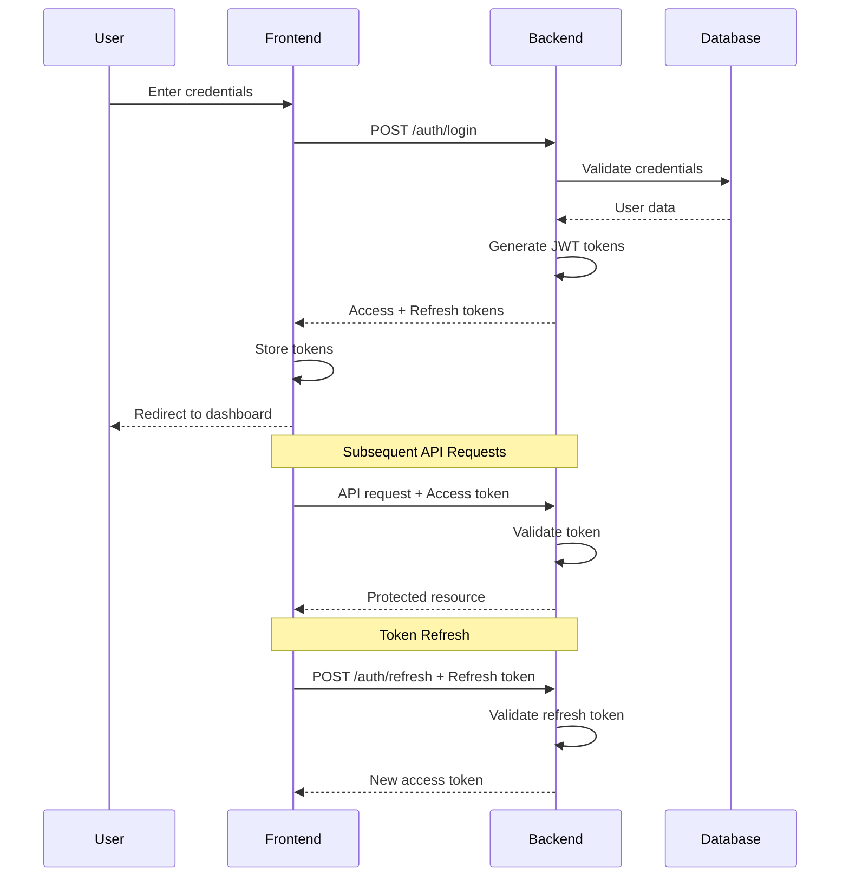

# JWT Authentication System - Design Document

## Overview

This design document outlines a professional, production-ready JWT-based authentication system for a full-stack application using NestJS (backend) and Next.js (frontend). The system implements secure user authentication, role-based access control (RBAC), and flexible permission management with a focus on security, scalability, and developer experience.

### Key Features

- **JWT Token Authentication**: Access tokens (15 min) and refresh tokens (7 days)
- **Role-Based Access Control**: Flexible RBAC with permissions tied to roles
- **Frontend Route Guards**: Automatic protection of routes based on authentication and permissions
- **Backend API Guards**: Decorators and middleware for protecting endpoints
- **Secure Password Management**: bcrypt hashing with salt rounds
- **Token Refresh Mechanism**: Seamless token renewal without re-authentication
- **Global Auth Context**: Centralized authentication state management in frontend
- **Permission-Based UI**: Dynamic UI rendering based on user permissions
- **Security Features**: Rate limiting, token blacklisting, audit logging

## Architecture

### High-Level Architecture

```
┌─────────────────────────────────────────────────────────────┐
│                        Frontend (Next.js)                    │
├─────────────────────────────────────────────────────────────┤
│  ┌──────────────┐  ┌──────────────┐  ┌──────────────┐     │
│  │ Auth Context │  │ Route Guards │  │ Permission   │     │
│  │              │  │              │  │ Components   │     │
│  └──────┬───────┘  └──────┬───────┘  └──────┬───────┘     │
│         │                  │                  │              │
│         └──────────────────┴──────────────────┘              │
│                            │                                 │
│                    ┌───────▼────────┐                       │
│                    │  API Client    │                       │
│                    │  (with tokens) │                       │
│                    └───────┬────────┘                       │
└────────────────────────────┼────────────────────────────────┘
                             │ HTTP + JWT
┌────────────────────────────▼────────────────────────────────┐
│                     Backend (NestJS)                         │
├─────────────────────────────────────────────────────────────┤
│  ┌──────────────┐  ┌──────────────┐  ┌──────────────┐     │
│  │ Auth Module  │  │ JWT Strategy │  │ Guards &     │     │
│  │              │  │              │  │ Decorators   │     │
│  └──────┬───────┘  └──────┬───────┘  └──────┬───────┘     │
│         │                  │                  │              │
│         └──────────────────┴──────────────────┘              │
│                            │                                 │
│                    ┌───────▼────────┐                       │
│                    │ Prisma Client  │                       │
│                    └───────┬────────┘                       │
└────────────────────────────┼────────────────────────────────┘
                             │
                    ┌────────▼────────┐
                    │   PostgreSQL    │
                    │   Database      │
                    └─────────────────┘
```

### Authentication Flow



## Components and Interfaces

### Backend Components

#### 1. Auth Module (`backend/src/auth/`)

**Purpose**: Central authentication module handling login, registration, token management

**Files**:
- `auth.module.ts` - Module definition with imports and providers
- `auth.controller.ts` - HTTP endpoints for auth operations
- `auth.service.ts` - Business logic for authentication
- `jwt.strategy.ts` - Passport JWT strategy implementation
- `jwt-auth.guard.ts` - Guard for protecting routes
- `permissions.guard.ts` - Guard for checking permissions
- `roles.guard.ts` - Guard for checking roles

**Key Methods**:
```typescript
// auth.service.ts
class AuthService {
  async register(dto: RegisterDto): Promise<AuthResponse>
  async login(dto: LoginDto): Promise<AuthResponse>
  async refreshToken(refreshToken: string): Promise<TokenResponse>
  async logout(userId: string, token: string): Promise<void>
  async validateUser(email: string, password: string): Promise<User>
  async generateTokens(user: User): Promise<TokenPair>
  async validateToken(token: string): Promise<JwtPayload>
  async revokeToken(token: string): Promise<void>
}
```

#### 2. Permission System (`backend/src/permissions/`)

**Purpose**: Manage permissions and role-permission mappings

**Database Schema Extension**:
```prisma
model Permission {
  id          String   @id @default(cuid())
  name        String   @unique  // e.g., "users:read", "users:write"
  description String?
  resource    String   // e.g., "users", "settings"
  action      String   // e.g., "read", "write", "delete"
  createdAt   DateTime @default(now())
  updatedAt   DateTime @updatedAt
  
  rolePermissions RolePermission[]
  
  @@map("permissions")
}

model RolePermission {
  id           String     @id @default(cuid())
  roleId       String     @map("role_id")
  permissionId String     @map("permission_id")
  role         UserRole   @relation(fields: [roleId], references: [id], onDelete: Cascade)
  permission   Permission @relation(fields: [permissionId], references: [id], onDelete: Cascade)
  createdAt    DateTime   @default(now())
  
  @@unique([roleId, permissionId])
  @@index([roleId])
  @@index([permissionId])
  @@map("role_permissions")
}

// Update UserRole model
model UserRole {
  // ... existing fields
  rolePermissions RolePermission[]
}
```

**Key Methods**:
```typescript
class PermissionsService {
  async createPermission(dto: CreatePermissionDto): Promise<Permission>
  async assignPermissionToRole(roleId: string, permissionId: string): Promise<void>
  async removePermissionFromRole(roleId: string, permissionId: string): Promise<void>
  async getRolePermissions(roleId: string): Promise<Permission[]>
  async userHasPermission(userId: string, permission: string): Promise<boolean>
}
```

#### 3. Token Blacklist (`backend/src/auth/token-blacklist/`)

**Purpose**: Manage revoked tokens before expiration

**Database Schema**:
```prisma
model TokenBlacklist {
  id        String   @id @default(cuid())
  token     String   @unique
  userId    String   @map("user_id")
  expiresAt DateTime @map("expires_at")
  createdAt DateTime @default(now()) @map("created_at")
  
  @@index([token])
  @@index([expiresAt])
  @@map("token_blacklist")
}
```

#### 4. Decorators and Guards

**Custom Decorators**:
```typescript
// @Public() - Mark routes as public (skip auth)
export const Public = () => SetMetadata('isPublic', true);

// @Permissions(...permissions) - Require specific permissions
export const Permissions = (...permissions: string[]) => 
  SetMetadata('permissions', permissions);

// @Roles(...roles) - Require specific roles
export const Roles = (...roles: string[]) => 
  SetMetadata('roles', roles);

// @CurrentUser() - Inject current user into route handler
export const CurrentUser = createParamDecorator(
  (data: unknown, ctx: ExecutionContext) => {
    const request = ctx.switchToHttp().getRequest();
    return request.user;
  },
);
```

**Guards**:
```typescript
// JwtAuthGuard - Validates JWT token
@Injectable()
export class JwtAuthGuard extends AuthGuard('jwt') {
  canActivate(context: ExecutionContext) {
    const isPublic = this.reflector.get('isPublic', context.getHandler());
    if (isPublic) return true;
    return super.canActivate(context);
  }
}

// PermissionsGuard - Checks user permissions
@Injectable()
export class PermissionsGuard implements CanActivate {
  async canActivate(context: ExecutionContext): Promise<boolean> {
    const requiredPermissions = this.reflector.get<string[]>('permissions', context.getHandler());
    if (!requiredPermissions) return true;
    
    const request = context.switchToHttp().getRequest();
    const user = request.user;
    
    return this.permissionsService.userHasPermissions(user.id, requiredPermissions);
  }
}

// RolesGuard - Checks user roles
@Injectable()
export class RolesGuard implements CanActivate {
  canActivate(context: ExecutionContext): boolean {
    const requiredRoles = this.reflector.get<string[]>('roles', context.getHandler());
    if (!requiredRoles) return true;
    
    const request = context.switchToHttp().getRequest();
    const user = request.user;
    
    return requiredRoles.includes(user.role.name);
  }
}
```

### Frontend Components

#### 1. Auth Context (`frontend/src/contexts/AuthContext.tsx`)

**Purpose**: Global authentication state management

**Interface**:
```typescript
interface AuthContextType {
  user: UserProfile | null;
  isAuthenticated: boolean;
  isLoading: boolean;
  login: (credentials: LoginCredentials) => Promise<void>;
  register: (data: RegisterUserData) => Promise<void>;
  logout: () => Promise<void>;
  refreshToken: () => Promise<void>;
  hasPermission: (permission: string) => boolean;
  hasRole: (role: string) => boolean;
  hasAnyPermission: (permissions: string[]) => boolean;
  hasAllPermissions: (permissions: string[]) => boolean;
}
```

**Implementation Details**:
- Uses React Context API for state management
- Stores tokens in localStorage (access token) and httpOnly cookies (refresh token)
- Automatically refreshes tokens before expiration
- Provides permission checking utilities
- Handles token expiration and automatic logout

#### 2. Route Guards (`frontend/src/components/auth/`)

**Components**:

**AuthGuard** - Protects routes requiring authentication:
```typescript
interface AuthGuardProps {
  children: React.ReactNode;
  fallback?: React.ReactNode;
  redirectTo?: string;
}

export function AuthGuard({ children, redirectTo = '/login' }: AuthGuardProps) {
  const { isAuthenticated, isLoading } = useAuth();
  const router = useRouter();
  
  useEffect(() => {
    if (!isLoading && !isAuthenticated) {
      router.push(redirectTo);
    }
  }, [isAuthenticated, isLoading]);
  
  if (isLoading) return <LoadingSpinner />;
  if (!isAuthenticated) return null;
  
  return <>{children}</>;
}
```

**PermissionGuard** - Protects routes/components by permission:
```typescript
interface PermissionGuardProps {
  children: React.ReactNode;
  permission: string | string[];
  requireAll?: boolean;
  fallback?: React.ReactNode;
}

export function PermissionGuard({ 
  children, 
  permission, 
  requireAll = false,
  fallback = <AccessDenied />
}: PermissionGuardProps) {
  const { hasPermission, hasAllPermissions, hasAnyPermission } = useAuth();
  
  const hasAccess = Array.isArray(permission)
    ? requireAll 
      ? hasAllPermissions(permission)
      : hasAnyPermission(permission)
    : hasPermission(permission);
  
  if (!hasAccess) return fallback;
  
  return <>{children}</>;
}
```

**RoleGuard** - Protects routes/components by role:
```typescript
interface RoleGuardProps {
  children: React.ReactNode;
  role: string | string[];
  fallback?: React.ReactNode;
}

export function RoleGuard({ children, role, fallback }: RoleGuardProps) {
  const { user, hasRole } = useAuth();
  
  const hasAccess = Array.isArray(role)
    ? role.includes(user?.role.name || '')
    : hasRole(role);
  
  if (!hasAccess) return fallback || <AccessDenied />;
  
  return <>{children}</>;
}
```

#### 3. Auth Pages

**Login Page** (`frontend/src/app/login/page.tsx`):
- Email/password form with validation
- "Remember me" checkbox
- Link to registration and password reset
- Error handling and display
- Redirect to intended page after login

**Signup Page** (`frontend/src/app/signup/page.tsx`):
- Registration form with validation
- Password strength indicator
- Terms of service acceptance
- Email verification flow (optional)
- Automatic login after registration

**Password Reset Flow**:
- Request reset page (email input)
- Reset token email
- New password page (with token validation)
- Confirmation and redirect to login

#### 4. API Client Integration (`frontend/src/lib/api.ts`)

**Token Management**:
```typescript
class ApiClient {
  private accessToken: string | null = null;
  
  setAccessToken(token: string) {
    this.accessToken = token;
    localStorage.setItem('accessToken', token);
  }
  
  getAccessToken(): string | null {
    return this.accessToken || localStorage.getItem('accessToken');
  }
  
  clearTokens() {
    this.accessToken = null;
    localStorage.removeItem('accessToken');
  }
  
  async request<T>(endpoint: string, options: RequestInit = {}): Promise<T> {
    const token = this.getAccessToken();
    
    const headers = {
      'Content-Type': 'application/json',
      ...(token && { Authorization: `Bearer ${token}` }),
      ...options.headers,
    };
    
    const response = await fetch(`${API_BASE_URL}${endpoint}`, {
      ...options,
      headers,
      credentials: 'include', // Include cookies for refresh token
    });
    
    // Handle 401 - try to refresh token
    if (response.status === 401) {
      const refreshed = await this.refreshToken();
      if (refreshed) {
        // Retry original request
        return this.request(endpoint, options);
      }
      // Refresh failed, redirect to login
      window.location.href = '/login';
      throw new Error('Authentication required');
    }
    
    if (!response.ok) {
      const error = await response.json();
      throw new Error(error.message || 'Request failed');
    }
    
    return response.json();
  }
  
  async refreshToken(): Promise<boolean> {
    try {
      const response = await fetch(`${API_BASE_URL}/auth/refresh`, {
        method: 'POST',
        credentials: 'include',
      });
      
      if (response.ok) {
        const { accessToken } = await response.json();
        this.setAccessToken(accessToken);
        return true;
      }
      return false;
    } catch {
      return false;
    }
  }
}
```

## Data Models

### JWT Payload Structure

```typescript
interface JwtPayload {
  sub: string;           // User ID
  email: string;         // User email
  roleId: string;        // Role ID
  roleName: string;      // Role name (e.g., "ADMIN")
  permissions: string[]; // Array of permission strings
  iat: number;          // Issued at
  exp: number;          // Expiration time
}
```

### Token Pair

```typescript
interface TokenPair {
  accessToken: string;   // Short-lived (15 min)
  refreshToken: string;  // Long-lived (7 days)
}
```

### Auth Response

```typescript
interface AuthResponse {
  user: UserProfile;
  accessToken: string;
  refreshToken: string;
  expiresIn: number;     // Access token expiration in seconds
}
```

### DTOs

**RegisterDto**:
```typescript
class RegisterDto {
  @IsEmail()
  email: string;
  
  @IsString()
  @MinLength(8)
  @Matches(/^(?=.*[a-z])(?=.*[A-Z])(?=.*\d)/, {
    message: 'Password must contain uppercase, lowercase, and number'
  })
  password: string;
  
  @IsString()
  @IsOptional()
  name?: string;
}
```

**LoginDto**:
```typescript
class LoginDto {
  @IsEmail()
  email: string;
  
  @IsString()
  password: string;
  
  @IsBoolean()
  @IsOptional()
  rememberMe?: boolean;
}
```

## Error Handling

### Backend Error Responses

```typescript
interface ErrorResponse {
  statusCode: number;
  message: string;
  error: string;
  timestamp: string;
  path: string;
}
```

**Common Error Scenarios**:
- `401 Unauthorized`: Invalid credentials, expired token, missing token
- `403 Forbidden`: Insufficient permissions, inactive account
- `409 Conflict`: Email already exists
- `429 Too Many Requests`: Rate limit exceeded
- `500 Internal Server Error`: Server-side errors (logged, generic message to client)

### Frontend Error Handling

```typescript
class AuthError extends Error {
  constructor(
    message: string,
    public code: string,
    public statusCode: number
  ) {
    super(message);
  }
}

// Usage in components
try {
  await login(credentials);
} catch (error) {
  if (error instanceof AuthError) {
    switch (error.code) {
      case 'INVALID_CREDENTIALS':
        setError('Invalid email or password');
        break;
      case 'ACCOUNT_INACTIVE':
        setError('Your account has been deactivated');
        break;
      case 'RATE_LIMIT_EXCEEDED':
        setError('Too many attempts. Please try again later');
        break;
      default:
        setError('An error occurred. Please try again');
    }
  }
}
```

## Testing Strategy

### Backend Tests

#### Unit Tests

**Auth Service Tests** (`auth.service.spec.ts`):
- User registration with valid data
- Registration with duplicate email
- Password hashing verification
- User login with valid credentials
- Login with invalid credentials
- Token generation and validation
- Token refresh flow
- Token revocation
- Permission checking logic

**Permissions Service Tests** (`permissions.service.spec.ts`):
- Create permission
- Assign permission to role
- Remove permission from role
- Check user permissions
- Get role permissions

#### Integration Tests

**Auth Controller Tests** (`auth.controller.spec.ts`):
- POST /auth/register endpoint
- POST /auth/login endpoint
- POST /auth/refresh endpoint
- POST /auth/logout endpoint
- GET /auth/profile endpoint (protected)

#### E2E Tests

**Auth Flow Tests** (`auth.e2e-spec.ts`):
- Complete registration flow
- Complete login flow
- Token refresh flow
- Logout flow
- Protected route access
- Permission-based access
- Role-based access

### Frontend Tests

#### Unit Tests

**Auth Context Tests**:
- Login function updates state correctly
- Logout clears state and tokens
- Permission checking functions
- Role checking functions
- Token refresh logic

**Guard Component Tests**:
- AuthGuard redirects unauthenticated users
- PermissionGuard shows/hides content based on permissions
- RoleGuard shows/hides content based on roles

#### Integration Tests

**Auth Flow Tests**:
- Login form submission
- Registration form submission
- Token storage and retrieval
- Automatic token refresh
- Logout clears all auth state

## Security Considerations

### Password Security
- Minimum 8 characters with complexity requirements
- bcrypt hashing with salt rounds of 10
- Password never returned in API responses
- Constant-time comparison for password validation

### Token Security
- Access tokens: Short-lived (15 minutes)
- Refresh tokens: Longer-lived (7 days), stored in httpOnly cookies
- Tokens include user ID, role, and permissions
- Token blacklist for revoked tokens
- Secure token generation using crypto libraries

### API Security
- Rate limiting on auth endpoints (5 attempts per 15 minutes)
- CORS configuration for allowed origins
- CSRF protection for state-changing operations
- Input validation on all endpoints
- SQL injection prevention via Prisma parameterized queries

### Frontend Security
- XSS prevention via React's built-in escaping
- Secure token storage (localStorage for access, httpOnly cookies for refresh)
- Automatic token refresh before expiration
- Redirect to login on authentication failure
- No sensitive data in URL parameters

### Audit Logging
- Log all authentication attempts (success and failure)
- Log permission checks and denials
- Log token generation and revocation
- Include timestamp, user ID, IP address, and action
- Store logs securely with retention policy

## Performance Considerations

### Backend Optimizations
- Cache role permissions in memory (Redis optional)
- Database indexes on frequently queried fields (email, roleId, token)
- Efficient permission checking with single query
- Token validation without database lookup (JWT signature verification)
- Cleanup expired blacklisted tokens periodically

### Frontend Optimizations
- Lazy load auth-related components
- Memoize permission checking functions
- Debounce token refresh attempts
- Cache user permissions in context
- Minimize re-renders on auth state changes

## Deployment Considerations

### Environment Variables

**Backend** (`.env`):
```env
JWT_SECRET=your-super-secret-jwt-key-change-in-production
JWT_ACCESS_EXPIRATION=15m
JWT_REFRESH_EXPIRATION=7d
BCRYPT_ROUNDS=10
RATE_LIMIT_TTL=900
RATE_LIMIT_MAX=5
```

**Frontend** (`.env.local`):
```env
NEXT_PUBLIC_API_URL=http://localhost:3001
NEXT_PUBLIC_APP_URL=http://localhost:3000
```

### Production Checklist
- [ ] Change JWT_SECRET to strong random value
- [ ] Enable HTTPS for all communications
- [ ] Configure CORS for production domains
- [ ] Set up rate limiting at API gateway level
- [ ] Enable audit logging to external service
- [ ] Configure token expiration based on security requirements
- [ ] Set up monitoring for failed auth attempts
- [ ] Implement account lockout after multiple failures
- [ ] Configure secure cookie settings (httpOnly, secure, sameSite)
- [ ] Set up database backups for user data
- [ ] Implement email verification for new accounts
- [ ] Set up password reset email service
- [ ] Configure session timeout warnings
- [ ] Implement multi-factor authentication (optional)

## Future Enhancements

### Phase 2 Features
- Multi-factor authentication (TOTP, SMS)
- OAuth2 integration (Google, GitHub, etc.)
- Session management dashboard
- Device tracking and management
- IP-based access restrictions
- Passwordless authentication (magic links)
- Biometric authentication support

### Phase 3 Features
- Fine-grained permissions (resource-level)
- Dynamic permission assignment
- Permission inheritance
- Audit log viewer in admin panel
- Advanced rate limiting (per user, per IP)
- Anomaly detection for suspicious activity
- Compliance reporting (GDPR, SOC2)
