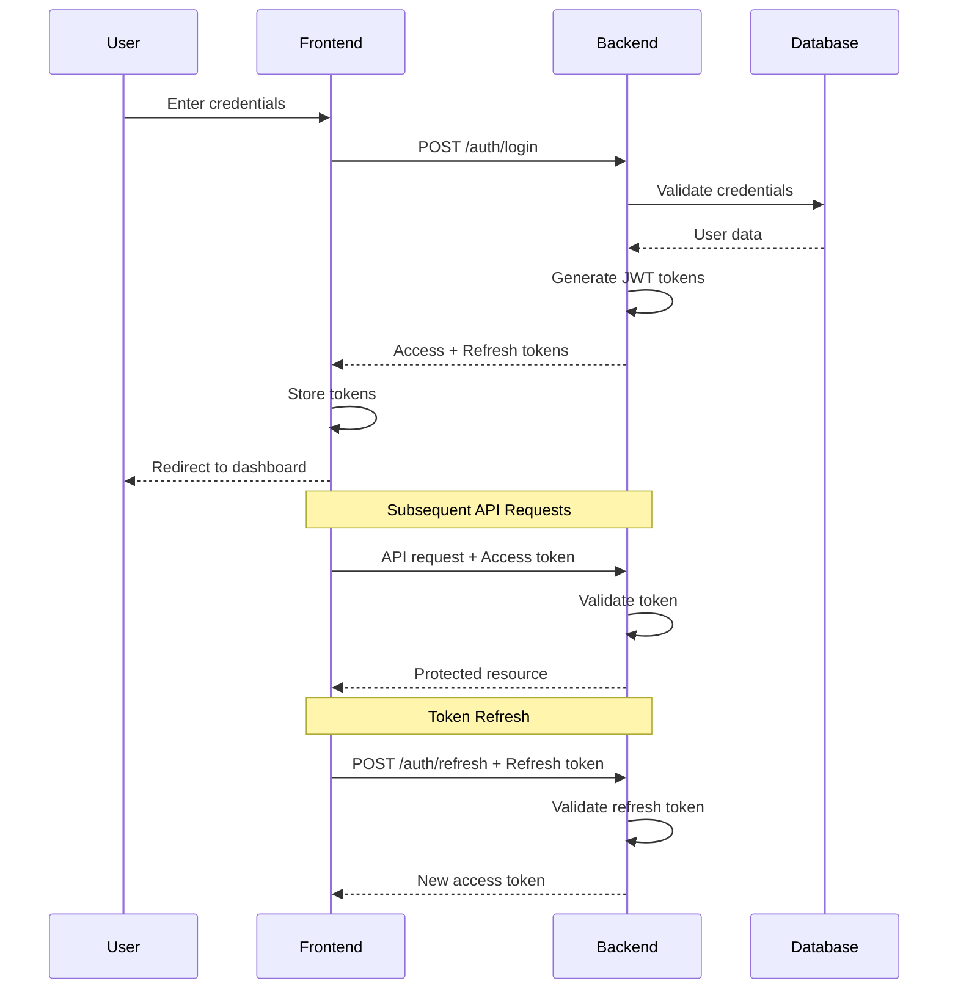

# JWT Authentication System - Design Document

## Overview

This design document outlines a professional, production-ready JWT-based authentication system for a full-stack application using NestJS (backend) and Next.js (frontend). The system is designed as a **starter kit template** that provides secure user authentication, role-based access control (RBAC), and flexible permission management with a focus on security, scalability, developer experience, and easy customization.

### Key Features

- **JWT Token Authentication**: Access tokens (15 min) and refresh tokens (7 days)
- **Role-Based Access Control**: Flexible RBAC with permissions tied to roles
- **Frontend Route Guards**: Automatic protection of routes based on authentication and permissions
- **Backend API Guards**: Decorators and middleware for protecting endpoints
- **Secure Password Management**: bcrypt hashing with salt rounds
- **Token Refresh Mechanism**: Seamless token renewal without re-authentication
- **Global Auth Context**: Centralized authentication state management in frontend
- **Permission-Based UI**: Dynamic UI rendering based on user permissions
- **Security Features**: Rate limiting, token blacklisting, audit logging
- **Template-Ready Configuration**: Easy customization without touching core code
- **Comprehensive Seeding**: Default roles and permissions for immediate use
- **Developer Tools**: Debug panel and documentation generators (dev mode)
- **Extensible Architecture**: Hooks for future features (OAuth, 2FA, email verification)

## Architecture

### High-Level Architecture

```
┌─────────────────────────────────────────────────────────────┐
│                        Frontend (Next.js)                    │
├─────────────────────────────────────────────────────────────┤
│  ┌──────────────┐  ┌──────────────┐  ┌──────────────┐     │
│  │ Auth Context │  │ Route Guards │  │ Permission   │     │
│  │              │  │              │  │ Components   │     │
│  └──────┬───────┘  └──────┬───────┘  └──────┬───────┘     │
│         │                  │                  │              │
│         └──────────────────┴──────────────────┘              │
│                            │                                 │
│                    ┌───────▼────────┐                       │
│                    │  API Client    │                       │
│                    │  (with tokens) │                       │
│                    └───────┬────────┘                       │
└────────────────────────────┼────────────────────────────────┘
                             │ HTTP + JWT
┌────────────────────────────▼────────────────────────────────┐
│                     Backend (NestJS)                         │
├─────────────────────────────────────────────────────────────┤
│  ┌──────────────┐  ┌──────────────┐  ┌──────────────┐     │
│  │ Auth Module  │  │ JWT Strategy │  │ Guards &     │     │
│  │              │  │              │  │ Decorators   │     │
│  └──────┬───────┘  └──────┬───────┘  └──────┬───────┘     │
│         │                  │                  │              │
│         └──────────────────┴──────────────────┘              │
│                            │                                 │
│                    ┌───────▼────────┐                       │
│                    │ Prisma Client  │                       │
│                    └───────┬────────┘                       │
└────────────────────────────┼────────────────────────────────┘
                             │
                    ┌────────▼────────┐
                    │   PostgreSQL    │
                    │   Database      │
                    └─────────────────┘
```

### Authentication Flow



## Template Configuration System

### Auth Configuration File

**Purpose**: Centralized configuration for easy customization without modifying core code

**File**: `backend/src/config/auth.config.ts`

```typescript
export const authConfig = {
  // Token expiration settings
  tokens: {
    accessTokenExpiration: process.env.JWT_ACCESS_EXPIRATION || '15m',
    refreshTokenExpiration: process.env.JWT_REFRESH_EXPIRATION || '7d',
    resetTokenExpiration: '1h',
  },
  
  // Password requirements
  password: {
    minLength: 8,
    requireUppercase: true,
    requireLowercase: true,
    requireNumbers: true,
    requireSpecialChars: false, // Can be enabled per project
  },
  
  // Security settings
  security: {
    bcryptRounds: 10,
    rateLimitTTL: 900, // 15 minutes
    rateLimitMax: 5,   // 5 attempts
    enableAuditLogging: true,
  },
  
  // Feature flags (for future extensibility)
  features: {
    emailVerification: false,    // Can be enabled later
    twoFactorAuth: false,         // Can be enabled later
    socialAuth: false,            // OAuth providers
    rememberMe: true,
    passwordReset: true,
    sessionManagement: false,     // View/revoke active sessions
  },
  
  // Default role assignment
  defaultRole: 'USER',
  
  // Permission naming convention
  permissionFormat: '{resource}:{action}', // e.g., users:read
};
```

**Frontend Configuration**: `frontend/src/config/auth.config.ts`

```typescript
export const authConfig = {
  // API endpoints
  endpoints: {
    login: '/auth/login',
    register: '/auth/register',
    logout: '/auth/logout',
    refresh: '/auth/refresh',
    profile: '/auth/profile',
  },
  
  // Token storage
  storage: {
    accessTokenKey: 'accessToken',
    useLocalStorage: true, // vs sessionStorage
  },
  
  // Redirect paths
  redirects: {
    afterLogin: '/dashboard',
    afterLogout: '/login',
    unauthorized: '/login',
    forbidden: '/403',
  },
  
  // Token refresh settings
  tokenRefresh: {
    enabled: true,
    refreshBeforeExpiry: 120, // seconds (2 minutes)
  },
  
  // UI settings
  ui: {
    showPasswordStrength: true,
    showRememberMe: true,
    enableDebugPanel: process.env.NODE_ENV === 'development',
  },
};
```

### Permission Naming Convention

**Standard Format**: `{resource}:{action}`

**Resources**: 
- `users` - User management
- `roles` - Role management
- `permissions` - Permission management
- `settings` - Application settings
- `profile` - User's own profile
- Custom resources as needed

**Actions**:
- `read` - View/list resources
- `write` - Create/update resources
- `delete` - Delete resources
- `admin` - Full administrative access to resource

**Special Permissions**:
- `*:*` - Super admin (all permissions)
- `{resource}:*` - All actions on a specific resource
- `profile:write` - Edit own profile (special case, not admin-level)

**Examples**:
```typescript
'users:read'        // Can view users
'users:write'       // Can create/edit users
'users:delete'      // Can delete users
'users:*'           // All user operations
'settings:admin'    // Full settings access
'profile:write'     // Edit own profile only
'*:*'               // Super admin
```

### Default Roles and Permissions

**Seeding Configuration**: `backend/prisma/seed-data/auth.seed.ts`

```typescript
export const DEFAULT_ROLES = {
  SUPER_ADMIN: {
    name: 'Super Admin',
    description: 'Full system access with all permissions',
    permissions: ['*:*'],
    isSystemRole: true, // Cannot be deleted
  },
  
  ADMIN: {
    name: 'Admin',
    description: 'Administrative access to most features',
    permissions: [
      'users:read', 'users:write', 'users:delete',
      'roles:read', 'roles:write',
      'permissions:read',
      'settings:read', 'settings:write',
      'profile:write',
    ],
    isSystemRole: true,
  },
  
  MANAGER: {
    name: 'Manager',
    description: 'Can manage users and view settings',
    permissions: [
      'users:read', 'users:write',
      'roles:read',
      'settings:read',
      'profile:write',
    ],
    isSystemRole: false, // Can be modified/deleted
  },
  
  USER: {
    name: 'User',
    description: 'Standard user with basic access',
    permissions: [
      'users:read',      // Can view user list
      'profile:write',   // Can edit own profile
      'settings:read',   // Can view settings
    ],
    isSystemRole: true,
  },
};

export const DEFAULT_PERMISSIONS = [
  // User management
  { name: 'users:read', resource: 'users', action: 'read', description: 'View users' },
  { name: 'users:write', resource: 'users', action: 'write', description: 'Create/edit users' },
  { name: 'users:delete', resource: 'users', action: 'delete', description: 'Delete users' },
  
  // Role management
  { name: 'roles:read', resource: 'roles', action: 'read', description: 'View roles' },
  { name: 'roles:write', resource: 'roles', action: 'write', description: 'Create/edit roles' },
  { name: 'roles:delete', resource: 'roles', action: 'delete', description: 'Delete roles' },
  
  // Permission management
  { name: 'permissions:read', resource: 'permissions', action: 'read', description: 'View permissions' },
  { name: 'permissions:write', resource: 'permissions', action: 'write', description: 'Assign permissions' },
  
  // Settings
  { name: 'settings:read', resource: 'settings', action: 'read', description: 'View settings' },
  { name: 'settings:write', resource: 'settings', action: 'write', description: 'Modify settings' },
  { name: 'settings:admin', resource: 'settings', action: 'admin', description: 'Full settings access' },
  
  // Profile
  { name: 'profile:write', resource: 'profile', action: 'write', description: 'Edit own profile' },
  
  // Super admin
  { name: '*:*', resource: '*', action: '*', description: 'All permissions' },
];
```

## Components and Interfaces

### Backend Components

#### 1. Auth Module (`backend/src/auth/`)

**Purpose**: Central authentication module handling login, registration, token management

**Files**:
- `auth.module.ts` - Module definition with imports and providers
- `auth.controller.ts` - HTTP endpoints for auth operations
- `auth.service.ts` - Business logic for authentication
- `jwt.strategy.ts` - Passport JWT strategy implementation
- `jwt-auth.guard.ts` - Guard for protecting routes
- `permissions.guard.ts` - Guard for checking permissions
- `roles.guard.ts` - Guard for checking roles

**Key Methods**:
```typescript
// auth.service.ts
class AuthService {
  async register(dto: RegisterDto): Promise<AuthResponse>
  async login(dto: LoginDto): Promise<AuthResponse>
  async refreshToken(refreshToken: string): Promise<TokenResponse>
  async logout(userId: string, token: string): Promise<void>
  async validateUser(email: string, password: string): Promise<User>
  async generateTokens(user: User): Promise<TokenPair>
  async validateToken(token: string): Promise<JwtPayload>
  async revokeToken(token: string): Promise<void>
}
```

#### 2. Permission System (`backend/src/permissions/`)

**Purpose**: Manage permissions and role-permission mappings

**Database Schema Extension**:
```prisma
model Permission {
  id          String   @id @default(cuid())
  name        String   @unique  // e.g., "users:read", "users:write"
  description String?
  resource    String   // e.g., "users", "settings"
  action      String   // e.g., "read", "write", "delete"
  createdAt   DateTime @default(now())
  updatedAt   DateTime @updatedAt
  
  rolePermissions RolePermission[]
  
  @@map("permissions")
}

model RolePermission {
  id           String     @id @default(cuid())
  roleId       String     @map("role_id")
  permissionId String     @map("permission_id")
  role         UserRole   @relation(fields: [roleId], references: [id], onDelete: Cascade)
  permission   Permission @relation(fields: [permissionId], references: [id], onDelete: Cascade)
  createdAt    DateTime   @default(now())
  
  @@unique([roleId, permissionId])
  @@index([roleId])
  @@index([permissionId])
  @@map("role_permissions")
}

// Update UserRole model
model UserRole {
  // ... existing fields
  rolePermissions RolePermission[]
}
```

**Key Methods**:
```typescript
class PermissionsService {
  async createPermission(dto: CreatePermissionDto): Promise<Permission>
  async assignPermissionToRole(roleId: string, permissionId: string): Promise<void>
  async removePermissionFromRole(roleId: string, permissionId: string): Promise<void>
  async getRolePermissions(roleId: string): Promise<Permission[]>
  async userHasPermission(userId: string, permission: string): Promise<boolean>
}
```

#### 3. Token Blacklist (`backend/src/auth/token-blacklist/`)

**Purpose**: Manage revoked tokens before expiration

**Database Schema**:
```prisma
model TokenBlacklist {
  id        String   @id @default(cuid())
  token     String   @unique
  userId    String   @map("user_id")
  expiresAt DateTime @map("expires_at")
  createdAt DateTime @default(now()) @map("created_at")
  
  @@index([token])
  @@index([expiresAt])
  @@map("token_blacklist")
}
```

#### 4. Decorators and Guards

**Custom Decorators**:
```typescript
// @Public() - Mark routes as public (skip auth)
export const Public = () => SetMetadata('isPublic', true);

// @Permissions(...permissions) - Require specific permissions
export const Permissions = (...permissions: string[]) => 
  SetMetadata('permissions', permissions);

// @Roles(...roles) - Require specific roles
export const Roles = (...roles: string[]) => 
  SetMetadata('roles', roles);

// @CurrentUser() - Inject current user into route handler
export const CurrentUser = createParamDecorator(
  (data: unknown, ctx: ExecutionContext) => {
    const request = ctx.switchToHttp().getRequest();
    return request.user;
  },
);
```

**Guards**:
```typescript
// JwtAuthGuard - Validates JWT token
@Injectable()
export class JwtAuthGuard extends AuthGuard('jwt') {
  canActivate(context: ExecutionContext) {
    const isPublic = this.reflector.get('isPublic', context.getHandler());
    if (isPublic) return true;
    return super.canActivate(context);
  }
}

// PermissionsGuard - Checks user permissions
@Injectable()
export class PermissionsGuard implements CanActivate {
  async canActivate(context: ExecutionContext): Promise<boolean> {
    const requiredPermissions = this.reflector.get<string[]>('permissions', context.getHandler());
    if (!requiredPermissions) return true;
    
    const request = context.switchToHttp().getRequest();
    const user = request.user;
    
    return this.permissionsService.userHasPermissions(user.id, requiredPermissions);
  }
}

// RolesGuard - Checks user roles
@Injectable()
export class RolesGuard implements CanActivate {
  canActivate(context: ExecutionContext): boolean {
    const requiredRoles = this.reflector.get<string[]>('roles', context.getHandler());
    if (!requiredRoles) return true;
    
    const request = context.switchToHttp().getRequest();
    const user = request.user;
    
    return requiredRoles.includes(user.role.name);
  }
}
```

### Developer Tools (Development Mode Only)

#### 1. Auth Debug Panel (`frontend/src/components/dev/AuthDebugPanel.tsx`)

**Purpose**: Help developers test and debug authentication during development

**Features**:
```typescript
interface AuthDebugPanelProps {
  position?: 'bottom-right' | 'bottom-left';
}

export function AuthDebugPanel() {
  const { user, isAuthenticated, hasPermission } = useAuth();
  
  return (
    <div className="fixed bottom-4 right-4 bg-gray-900 text-white p-4 rounded-lg shadow-lg max-w-md">
      <h3>Auth Debug Panel</h3>
      
      {/* Current User Info */}
      <div>
        <strong>User:</strong> {user?.email || 'Not authenticated'}
        <strong>Role:</strong> {user?.role.name}
      </div>
      
      {/* Token Info */}
      <div>
        <strong>Access Token:</strong> {getTokenExpiry()}
        <button onClick={forceRefresh}>Force Refresh</button>
      </div>
      
      {/* Permissions List */}
      <div>
        <strong>Permissions:</strong>
        <ul>
          {user?.permissions.map(p => (
            <li key={p}>{p}</li>
          ))}
        </ul>
      </div>
      
      {/* Permission Tester */}
      <div>
        <input 
          placeholder="Test permission (e.g., users:write)"
          onChange={(e) => setTestPerm(e.target.value)}
        />
        <span>Has permission: {hasPermission(testPerm) ? '✅' : '❌'}</span>
      </div>
      
      {/* Quick Actions */}
      <div>
        <button onClick={logout}>Logout</button>
        <button onClick={clearTokens}>Clear Tokens</button>
      </div>
    </div>
  );
}
```

**Usage**: Only rendered in development mode
```typescript
// In layout.tsx
{process.env.NODE_ENV === 'development' && <AuthDebugPanel />}
```

#### 2. Permission Documentation Generator

**Script**: `.kiro/scripts/generate-permission-docs.ts`

**Purpose**: Automatically generate documentation of all protected endpoints

```typescript
// Scans backend controllers for @Permissions() decorators
// Generates markdown documentation

// Output: docs/API_PERMISSIONS.md
/*
# API Permissions Documentation

## User Management Endpoints

### GET /users
- **Permission Required**: `users:read`
- **Description**: List all users
- **Role Access**: Admin, Manager, User

### POST /users
- **Permission Required**: `users:write`
- **Description**: Create new user
- **Role Access**: Admin, Manager

...
*/
```

**Usage**:
```bash
npm run generate:permission-docs
```

### Frontend Components

#### 1. Auth Context (`frontend/src/contexts/AuthContext.tsx`)

**Purpose**: Global authentication state management

**Interface**:
```typescript
interface AuthContextType {
  user: UserProfile | null;
  isAuthenticated: boolean;
  isLoading: boolean;
  login: (credentials: LoginCredentials) => Promise<void>;
  register: (data: RegisterUserData) => Promise<void>;
  logout: () => Promise<void>;
  refreshToken: () => Promise<void>;
  hasPermission: (permission: string) => boolean;
  hasRole: (role: string) => boolean;
  hasAnyPermission: (permissions: string[]) => boolean;
  hasAllPermissions: (permissions: string[]) => boolean;
}
```

**Implementation Details**:
- Uses React Context API for state management
- Stores tokens in localStorage (access token) and httpOnly cookies (refresh token)
- Automatically refreshes tokens before expiration
- Provides permission checking utilities
- Handles token expiration and automatic logout

#### 2. Route Guards (`frontend/src/components/auth/`)

**Components**:

**AuthGuard** - Protects routes requiring authentication:
```typescript
interface AuthGuardProps {
  children: React.ReactNode;
  fallback?: React.ReactNode;
  redirectTo?: string;
}

export function AuthGuard({ children, redirectTo = '/login' }: AuthGuardProps) {
  const { isAuthenticated, isLoading } = useAuth();
  const router = useRouter();
  
  useEffect(() => {
    if (!isLoading && !isAuthenticated) {
      router.push(redirectTo);
    }
  }, [isAuthenticated, isLoading]);
  
  if (isLoading) return <LoadingSpinner />;
  if (!isAuthenticated) return null;
  
  return <>{children}</>;
}
```

**PermissionGuard** - Protects routes/components by permission:
```typescript
interface PermissionGuardProps {
  children: React.ReactNode;
  permission: string | string[];
  requireAll?: boolean;
  fallback?: React.ReactNode;
}

export function PermissionGuard({ 
  children, 
  permission, 
  requireAll = false,
  fallback = <AccessDenied />
}: PermissionGuardProps) {
  const { hasPermission, hasAllPermissions, hasAnyPermission } = useAuth();
  
  const hasAccess = Array.isArray(permission)
    ? requireAll 
      ? hasAllPermissions(permission)
      : hasAnyPermission(permission)
    : hasPermission(permission);
  
  if (!hasAccess) return fallback;
  
  return <>{children}</>;
}
```

**RoleGuard** - Protects routes/components by role:
```typescript
interface RoleGuardProps {
  children: React.ReactNode;
  role: string | string[];
  fallback?: React.ReactNode;
}

export function RoleGuard({ children, role, fallback }: RoleGuardProps) {
  const { user, hasRole } = useAuth();
  
  const hasAccess = Array.isArray(role)
    ? role.includes(user?.role.name || '')
    : hasRole(role);
  
  if (!hasAccess) return fallback || <AccessDenied />;
  
  return <>{children}</>;
}
```

#### 3. Auth Pages

**Login Page** (`frontend/src/app/login/page.tsx`):
- Email/password form with validation
- "Remember me" checkbox
- Link to registration and password reset
- Error handling and display
- Redirect to intended page after login

**Signup Page** (`frontend/src/app/signup/page.tsx`):
- Registration form with validation
- Password strength indicator
- Terms of service acceptance
- Email verification flow (optional)
- Automatic login after registration

**Password Reset Flow**:
- Request reset page (email input)
- Reset token email
- New password page (with token validation)
- Confirmation and redirect to login

#### 4. Convenience Hooks

**usePermission Hook** (`frontend/src/hooks/usePermission.ts`):
```typescript
/**
 * Simplified hook for checking a single permission
 * @example
 * const canEditUsers = usePermission('users:write');
 * if (canEditUsers) { ... }
 */
export function usePermission(permission: string): boolean {
  const { hasPermission } = useAuth();
  return hasPermission(permission);
}
```

**useRequireAuth Hook** (`frontend/src/hooks/useRequireAuth.ts`):
```typescript
/**
 * Hook that redirects to login if not authenticated
 * Use in pages that require authentication
 * @example
 * const { isLoading } = useRequireAuth();
 * if (isLoading) return <Loading />;
 */
export function useRequireAuth(redirectTo = '/login') {
  const { isAuthenticated, isLoading } = useAuth();
  const router = useRouter();
  
  useEffect(() => {
    if (!isLoading && !isAuthenticated) {
      // Store intended destination
      sessionStorage.setItem('redirectAfterLogin', window.location.pathname);
      router.push(redirectTo);
    }
  }, [isAuthenticated, isLoading, redirectTo, router]);
  
  return { isAuthenticated, isLoading };
}
```

**useRequirePermission Hook** (`frontend/src/hooks/useRequirePermission.ts`):
```typescript
/**
 * Hook that redirects to forbidden page if permission missing
 * @example
 * const { hasAccess, isLoading } = useRequirePermission('users:write');
 */
export function useRequirePermission(
  permission: string | string[],
  requireAll = false
) {
  const { hasPermission, hasAllPermissions, hasAnyPermission, isLoading } = useAuth();
  const router = useRouter();
  
  const hasAccess = useMemo(() => {
    if (isLoading) return false;
    
    if (Array.isArray(permission)) {
      return requireAll 
        ? hasAllPermissions(permission)
        : hasAnyPermission(permission);
    }
    return hasPermission(permission);
  }, [permission, requireAll, hasPermission, hasAllPermissions, hasAnyPermission, isLoading]);
  
  useEffect(() => {
    if (!isLoading && !hasAccess) {
      router.push('/403');
    }
  }, [hasAccess, isLoading, router]);
  
  return { hasAccess, isLoading };
}
```

**useRole Hook** (`frontend/src/hooks/useRole.ts`):
```typescript
/**
 * Hook for checking user role
 * @example
 * const isAdmin = useRole('Admin');
 */
export function useRole(role: string | string[]): boolean {
  const { user } = useAuth();
  
  if (!user) return false;
  
  if (Array.isArray(role)) {
    return role.includes(user.role.name);
  }
  
  return user.role.name === role;
}
```

#### 5. API Client Integration (`frontend/src/lib/api.ts`)

**Token Management**:
```typescript
class ApiClient {
  private accessToken: string | null = null;
  
  setAccessToken(token: string) {
    this.accessToken = token;
    localStorage.setItem('accessToken', token);
  }
  
  getAccessToken(): string | null {
    return this.accessToken || localStorage.getItem('accessToken');
  }
  
  clearTokens() {
    this.accessToken = null;
    localStorage.removeItem('accessToken');
  }
  
  async request<T>(endpoint: string, options: RequestInit = {}): Promise<T> {
    const token = this.getAccessToken();
    
    const headers = {
      'Content-Type': 'application/json',
      ...(token && { Authorization: `Bearer ${token}` }),
      ...options.headers,
    };
    
    const response = await fetch(`${API_BASE_URL}${endpoint}`, {
      ...options,
      headers,
      credentials: 'include', // Include cookies for refresh token
    });
    
    // Handle 401 - try to refresh token
    if (response.status === 401) {
      const refreshed = await this.refreshToken();
      if (refreshed) {
        // Retry original request
        return this.request(endpoint, options);
      }
      // Refresh failed, redirect to login
      window.location.href = '/login';
      throw new Error('Authentication required');
    }
    
    if (!response.ok) {
      const error = await response.json();
      throw new Error(error.message || 'Request failed');
    }
    
    return response.json();
  }
  
  async refreshToken(): Promise<boolean> {
    try {
      const response = await fetch(`${API_BASE_URL}/auth/refresh`, {
        method: 'POST',
        credentials: 'include',
      });
      
      if (response.ok) {
        const { accessToken } = await response.json();
        this.setAccessToken(accessToken);
        return true;
      }
      return false;
    } catch {
      return false;
    }
  }
}
```

## Migration and Extensibility

### Migration from Existing System

**Migration Script**: `backend/src/scripts/migrate-to-permissions.ts`

**Purpose**: Migrate existing users from old role system to new permission-based system

```typescript
/**
 * Migration steps:
 * 1. Create new Permission and RolePermission tables
 * 2. Seed default permissions
 * 3. Map existing roles to new permission system
 * 4. Verify all users have valid role assignments
 * 5. Update any hardcoded role checks to use permissions
 */

async function migrateToPermissionSystem() {
  // 1. Backup existing data
  await backupDatabase();
  
  // 2. Run Prisma migration
  await runPrismaMigration();
  
  // 3. Seed permissions
  await seedPermissions();
  
  // 4. Map existing roles
  const roleMapping = {
    'ADMIN': ['users:*', 'settings:*', 'roles:*'],
    'USER': ['users:read', 'profile:write'],
  };
  
  for (const [roleName, permissions] of Object.entries(roleMapping)) {
    await assignPermissionsToRole(roleName, permissions);
  }
  
  // 5. Verify migration
  await verifyMigration();
  
  console.log('Migration complete!');
}
```

### Extensibility Hooks

**Future Feature Support**: The system is designed with hooks for future enhancements

#### Email Verification (Disabled by Default)

**Database Schema** (ready but not enforced):
```prisma
model User {
  // ... existing fields
  emailVerified Boolean  @default(false) @map("email_verified")
  verificationToken String? @unique @map("verification_token")
  verificationTokenExpiry DateTime? @map("verification_token_expiry")
}
```

**Enable in config**:
```typescript
features: {
  emailVerification: true, // Enable email verification
}
```

#### OAuth/Social Authentication (Prepared)

**Database Schema** (ready for OAuth):
```prisma
model User {
  // ... existing fields
  authProvider String @default("local") @map("auth_provider") // 'local', 'google', 'github'
  providerId String? @map("provider_id") // OAuth provider user ID
}
```

**Enable in config**:
```typescript
features: {
  socialAuth: true,
}

oauth: {
  google: {
    clientId: process.env.GOOGLE_CLIENT_ID,
    clientSecret: process.env.GOOGLE_CLIENT_SECRET,
  },
  github: {
    clientId: process.env.GITHUB_CLIENT_ID,
    clientSecret: process.env.GITHUB_CLIENT_SECRET,
  },
}
```

#### Two-Factor Authentication (Prepared)

**Database Schema** (ready for 2FA):
```prisma
model User {
  // ... existing fields
  twoFactorEnabled Boolean @default(false) @map("two_factor_enabled")
  twoFactorSecret String? @map("two_factor_secret")
}
```

#### Session Management (Prepared)

**Database Schema** (ready for session tracking):
```prisma
model UserSession {
  id        String   @id @default(cuid())
  userId    String   @map("user_id")
  token     String   @unique
  ipAddress String   @map("ip_address")
  userAgent String   @map("user_agent")
  lastActive DateTime @default(now()) @map("last_active")
  expiresAt DateTime @map("expires_at")
  createdAt DateTime @default(now()) @map("created_at")
  
  user User @relation(fields: [userId], references: [id], onDelete: Cascade)
  
  @@index([userId])
  @@index([token])
  @@map("user_sessions")
}
```

## Data Models

### JWT Payload Structure

```typescript
interface JwtPayload {
  sub: string;           // User ID
  email: string;         // User email
  roleId: string;        // Role ID
  roleName: string;      // Role name (e.g., "ADMIN")
  permissions: string[]; // Array of permission strings
  iat: number;          // Issued at
  exp: number;          // Expiration time
}
```

### Token Pair

```typescript
interface TokenPair {
  accessToken: string;   // Short-lived (15 min)
  refreshToken: string;  // Long-lived (7 days)
}
```

### Auth Response

```typescript
interface AuthResponse {
  user: UserProfile;
  accessToken: string;
  refreshToken: string;
  expiresIn: number;     // Access token expiration in seconds
}
```

### DTOs

**RegisterDto**:
```typescript
class RegisterDto {
  @IsEmail()
  email: string;
  
  @IsString()
  @MinLength(8)
  @Matches(/^(?=.*[a-z])(?=.*[A-Z])(?=.*\d)/, {
    message: 'Password must contain uppercase, lowercase, and number'
  })
  password: string;
  
  @IsString()
  @IsOptional()
  name?: string;
}
```

**LoginDto**:
```typescript
class LoginDto {
  @IsEmail()
  email: string;
  
  @IsString()
  password: string;
  
  @IsBoolean()
  @IsOptional()
  rememberMe?: boolean;
}
```

## Error Handling

### Backend Error Responses

```typescript
interface ErrorResponse {
  statusCode: number;
  message: string;
  error: string;
  timestamp: string;
  path: string;
}
```

**Common Error Scenarios**:
- `401 Unauthorized`: Invalid credentials, expired token, missing token
- `403 Forbidden`: Insufficient permissions, inactive account
- `409 Conflict`: Email already exists
- `429 Too Many Requests`: Rate limit exceeded
- `500 Internal Server Error`: Server-side errors (logged, generic message to client)

### Frontend Error Handling

```typescript
class AuthError extends Error {
  constructor(
    message: string,
    public code: string,
    public statusCode: number
  ) {
    super(message);
  }
}

// Usage in components
try {
  await login(credentials);
} catch (error) {
  if (error instanceof AuthError) {
    switch (error.code) {
      case 'INVALID_CREDENTIALS':
        setError('Invalid email or password');
        break;
      case 'ACCOUNT_INACTIVE':
        setError('Your account has been deactivated');
        break;
      case 'RATE_LIMIT_EXCEEDED':
        setError('Too many attempts. Please try again later');
        break;
      default:
        setError('An error occurred. Please try again');
    }
  }
}
```

## Testing Strategy

### Backend Tests

#### Unit Tests

**Auth Service Tests** (`auth.service.spec.ts`):
- User registration with valid data
- Registration with duplicate email
- Password hashing verification
- User login with valid credentials
- Login with invalid credentials
- Token generation and validation
- Token refresh flow
- Token revocation
- Permission checking logic

**Permissions Service Tests** (`permissions.service.spec.ts`):
- Create permission
- Assign permission to role
- Remove permission from role
- Check user permissions
- Get role permissions

#### Integration Tests

**Auth Controller Tests** (`auth.controller.spec.ts`):
- POST /auth/register endpoint
- POST /auth/login endpoint
- POST /auth/refresh endpoint
- POST /auth/logout endpoint
- GET /auth/profile endpoint (protected)

#### E2E Tests

**Auth Flow Tests** (`auth.e2e-spec.ts`):
- Complete registration flow
- Complete login flow
- Token refresh flow
- Logout flow
- Protected route access
- Permission-based access
- Role-based access

### Frontend Tests

#### Unit Tests

**Auth Context Tests**:
- Login function updates state correctly
- Logout clears state and tokens
- Permission checking functions
- Role checking functions
- Token refresh logic

**Guard Component Tests**:
- AuthGuard redirects unauthenticated users
- PermissionGuard shows/hides content based on permissions
- RoleGuard shows/hides content based on roles

#### Integration Tests

**Auth Flow Tests**:
- Login form submission
- Registration form submission
- Token storage and retrieval
- Automatic token refresh
- Logout clears all auth state

## Security Considerations

### Password Security
- Minimum 8 characters with complexity requirements
- bcrypt hashing with salt rounds of 10
- Password never returned in API responses
- Constant-time comparison for password validation

### Token Security
- Access tokens: Short-lived (15 minutes)
- Refresh tokens: Longer-lived (7 days), stored in httpOnly cookies
- Tokens include user ID, role, and permissions
- Token blacklist for revoked tokens
- Secure token generation using crypto libraries

### API Security
- Rate limiting on auth endpoints (5 attempts per 15 minutes)
- CORS configuration for allowed origins
- CSRF protection for state-changing operations
- Input validation on all endpoints
- SQL injection prevention via Prisma parameterized queries

### Frontend Security
- XSS prevention via React's built-in escaping
- Secure token storage (localStorage for access, httpOnly cookies for refresh)
- Automatic token refresh before expiration
- Redirect to login on authentication failure
- No sensitive data in URL parameters

### Audit Logging
- Log all authentication attempts (success and failure)
- Log permission checks and denials
- Log token generation and revocation
- Include timestamp, user ID, IP address, and action
- Store logs securely with retention policy

## Performance Considerations

### Backend Optimizations
- Cache role permissions in memory (Redis optional)
- Database indexes on frequently queried fields (email, roleId, token)
- Efficient permission checking with single query
- Token validation without database lookup (JWT signature verification)
- Cleanup expired blacklisted tokens periodically

### Frontend Optimizations
- Lazy load auth-related components
- Memoize permission checking functions
- Debounce token refresh attempts
- Cache user permissions in context
- Minimize re-renders on auth state changes

## Deployment Considerations

### Environment Variables

**Backend** (`.env`):
```env
JWT_SECRET=your-super-secret-jwt-key-change-in-production
JWT_ACCESS_EXPIRATION=15m
JWT_REFRESH_EXPIRATION=7d
BCRYPT_ROUNDS=10
RATE_LIMIT_TTL=900
RATE_LIMIT_MAX=5
```

**Frontend** (`.env.local`):
```env
NEXT_PUBLIC_API_URL=http://localhost:3001
NEXT_PUBLIC_APP_URL=http://localhost:3000
```

### Production Checklist
- [ ] Change JWT_SECRET to strong random value
- [ ] Enable HTTPS for all communications
- [ ] Configure CORS for production domains
- [ ] Set up rate limiting at API gateway level
- [ ] Enable audit logging to external service
- [ ] Configure token expiration based on security requirements
- [ ] Set up monitoring for failed auth attempts
- [ ] Implement account lockout after multiple failures
- [ ] Configure secure cookie settings (httpOnly, secure, sameSite)
- [ ] Set up database backups for user data
- [ ] Implement email verification for new accounts
- [ ] Set up password reset email service
- [ ] Configure session timeout warnings
- [ ] Implement multi-factor authentication (optional)

## Template Customization Guide

### For Template Users

**Quick Start Customization**:

1. **Configure Authentication Settings**:
   - Edit `backend/src/config/auth.config.ts`
   - Edit `frontend/src/config/auth.config.ts`
   - Update environment variables

2. **Customize Roles and Permissions**:
   - Edit `backend/prisma/seed-data/auth.seed.ts`
   - Add your application-specific permissions
   - Run `npm run prisma:seed`

3. **Add New Protected Resources**:
   ```typescript
   // Backend: Add permission check
   @Get()
   @Permissions('posts:read')
   async getPosts() { ... }
   
   // Frontend: Add permission guard
   <PermissionGuard permission="posts:read">
     <PostsList />
   </PermissionGuard>
   ```

4. **Customize UI**:
   - Modify login/signup pages in `frontend/src/app/(auth)/`
   - Update branding and styling
   - Customize error messages

5. **Enable Optional Features**:
   ```typescript
   // In auth.config.ts
   features: {
     emailVerification: true,  // Enable email verification
     twoFactorAuth: true,      // Enable 2FA
     socialAuth: true,         // Enable OAuth
   }
   ```

### Adding New Permissions

**Step-by-step**:

1. **Define Permission**:
   ```typescript
   // In seed-data/auth.seed.ts
   { 
     name: 'posts:write', 
     resource: 'posts', 
     action: 'write', 
     description: 'Create/edit posts' 
   }
   ```

2. **Assign to Roles**:
   ```typescript
   ADMIN: {
     permissions: [
       // ... existing
       'posts:write',
     ]
   }
   ```

3. **Protect Backend Endpoint**:
   ```typescript
   @Post()
   @Permissions('posts:write')
   async createPost() { ... }
   ```

4. **Protect Frontend UI**:
   ```typescript
   const canCreatePost = usePermission('posts:write');
   
   {canCreatePost && <CreatePostButton />}
   ```

5. **Reseed Database**:
   ```bash
   npm run prisma:seed
   ```

## Future Enhancements

### Phase 1: Core Template (Current)
- ✅ JWT authentication with refresh tokens
- ✅ RBAC with flexible permissions
- ✅ Frontend and backend guards
- ✅ Configuration system
- ✅ Default roles and permissions
- ✅ Developer tools
- ✅ Migration scripts

### Phase 2: Optional Features (Prepared, Disabled by Default)
- 📦 Email verification flow
- 📦 Two-factor authentication (TOTP)
- 📦 OAuth2 integration (Google, GitHub, etc.)
- 📦 Session management dashboard
- 📦 Password reset via email
- 📦 Account lockout after failed attempts

### Phase 3: Advanced Features (Future)
- 🔮 Fine-grained permissions (resource-level: "edit own posts only")
- 🔮 Permission inheritance and hierarchies
- 🔮 Audit log viewer in admin panel
- 🔮 Advanced rate limiting (per user, per IP, per endpoint)
- 🔮 Anomaly detection for suspicious activity
- 🔮 Compliance reporting (GDPR, SOC2)
- 🔮 Passwordless authentication (magic links)
- 🔮 Biometric authentication support
- 🔮 Multi-tenancy support

### Template Philosophy

This authentication system follows a **progressive enhancement** approach:

1. **Core First**: Solid, production-ready JWT auth with RBAC
2. **Configuration Over Code**: Easy customization via config files
3. **Extensible by Design**: Hooks and schemas ready for future features
4. **Developer Friendly**: Debug tools, documentation generators, clear conventions
5. **Template Ready**: Can be dropped into any project and customized quickly

The goal is to provide a **complete, working authentication system** that developers can:
- Use immediately without modifications
- Customize easily through configuration
- Extend with advanced features when needed
- Learn from as a reference implementation
