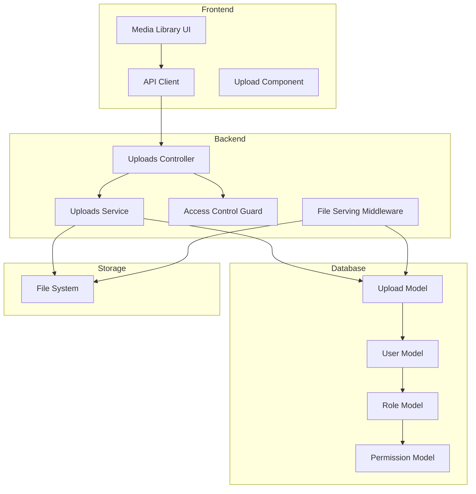

# Design Document

## Overview

The Media Library System extends the existing full-stack application with comprehensive file management capabilities. It introduces database-backed file tracking, three-tier visibility control (PUBLIC, PRIVATE, ROLE_BASED), and a rich user interface for file organization and management. The system integrates with the existing authentication, authorization, and permissions infrastructure while adding new capabilities for usage tracking, soft deletion, and bulk operations.

## Architecture

### System Components



### Data Flow

**Upload Flow:**
1. User selects file in Media Library UI
2. Frontend sends multipart/form-data to `/uploads` endpoint
3. Backend validates user has `media:upload` permission
4. File is saved to filesystem with generated UUID filename
5. Upload record created in database with metadata
6. Response returns database record with public URL
7. Frontend displays success and refreshes file list

**Access Control Flow:**
1. User requests file via public URL
2. File serving middleware intercepts request
3. Middleware looks up Upload record by filename
4. Middleware extracts user from JWT token
5. Middleware applies visibility rules:
   - Admin/Super Admin: Allow all
   - PUBLIC: Allow all authenticated users
   - PRIVATE: Allow only uploader and admins
   - ROLE_BASED: Allow if user's role in allowedRoles array
6. If allowed, serve file; otherwise return 403

**Metadata Update Flow:**
1. User edits file metadata in UI
2. Frontend sends PATCH to `/uploads/:id`
3. Backend verifies user owns file or is admin
4. Backend validates visibility and role settings
5. Database record updated
6. Response returns updated record
7. Frontend updates UI

## Components and Interfaces

### Database Models

#### Upload Model (Prisma Schema)

```prisma
model Upload {
  id              String        @id @default(uuid())
  filename        String        @unique // Generated UUID filename
  originalName    String        // Original uploaded filename
  mimeType        String
  size            Int           // Bytes
  url             String        // Public URL
  path            String        // Filesystem path
  type            UploadType
  category        String?
  
  // Ownership
  uploadedById    String
  uploadedBy      User          @relation(fields: [uploadedById], references: [id], onDelete: Cascade)
  
  // Access Control
  visibility      Visibility    @default(PRIVATE)
  allowedRoles    String[]      @default([])
  
  // Usage Tracking
  usedIn          Json?         // { products: ['id1'], blogPosts: ['id2'], avatars: ['id3'] }
  usageCount      Int           @default(0)
  
  // Metadata
  altText         String?
  title           String?
  description     String?
  tags            String[]      @default([])
  
  // Image Dimensions
  width           Int?
  height          Int?
  
  // Timestamps
  createdAt       DateTime      @default(now())
  updatedAt       DateTime      @updatedAt
  
  // Soft Delete
  deletedAt       DateTime?
  deletedById     String?
  deletedBy       User?         @relation("DeletedUploads", fields: [deletedById], references: [id])
  
  @@index([uploadedById])
  @@index([type])
  @@index([visibility])
  @@index([createdAt])
  @@index([deletedAt])
}

enum UploadType {
  IMAGE
  DOCUMENT
  AVATAR
  EDITOR_IMAGE
}

enum Visibility {
  PUBLIC
  PRIVATE
  ROLE_BASED
}

// Update User model
model User {
  // ... existing fields
  uploads         Upload[]      @relation
  deletedUploads  Upload[]      @relation("DeletedUploads")
}
```

### Backend DTOs

#### CreateUploadDto
```typescript
export class CreateUploadDto {
  @IsString()
  @IsNotEmpty()
  filename: string;

  @IsString()
  @IsNotEmpty()
  originalName: string;

  @IsString()
  @IsNotEmpty()
  mimeType: string;

  @IsInt()
  @Min(0)
  size: number;

  @IsString()
  @IsNotEmpty()
  url: string;

  @IsString()
  @IsNotEmpty()
  path: string;

  @IsEnum(UploadType)
  type: UploadType;

  @IsString()
  @IsOptional()
  category?: string;

  @IsString()
  @IsOptional()
  altText?: string;

  @IsString()
  @IsOptional()
  title?: string;

  @IsString()
  @IsOptional()
  description?: string;

  @IsArray()
  @IsString({ each: true })
  @IsOptional()
  tags?: string[];

  @IsInt()
  @IsOptional()
  width?: number;

  @IsInt()
  @IsOptional()
  height?: number;
}
```

#### GetUploadsQueryDto
```typescript
export class GetUploadsQueryDto {
  @IsEnum(UploadType)
  @IsOptional()
  type?: UploadType;

  @IsEnum(Visibility)
  @IsOptional()
  visibility?: Visibility;

  @IsString()
  @IsOptional()
  uploadedBy?: string;

  @IsDateString()
  @IsOptional()
  startDate?: string;

  @IsDateString()
  @IsOptional()
  endDate?: string;

  @IsString()
  @IsOptional()
  search?: string;

  @IsInt()
  @Min(1)
  @IsOptional()
  @Type(() => Number)
  page?: number = 1;

  @IsInt()
  @Min(1)
  @Max(100)
  @IsOptional()
  @Type(() => Number)
  limit?: number = 20;

  @IsString()
  @IsOptional()
  sortBy?: 'createdAt' | 'size' | 'filename' | 'type' = 'createdAt';

  @IsString()
  @IsOptional()
  sortOrder?: 'asc' | 'desc' = 'desc';
}
```

#### UpdateUploadDto
```typescript
export class UpdateUploadDto {
  @IsString()
  @IsOptional()
  title?: string;

  @IsString()
  @IsOptional()
  description?: string;

  @IsString()
  @IsOptional()
  altText?: string;

  @IsArray()
  @IsString({ each: true })
  @IsOptional()
  tags?: string[];

  @IsEnum(Visibility)
  @IsOptional()
  visibility?: Visibility;

  @IsArray()
  @IsString({ each: true })
  @IsOptional()
  allowedRoles?: string[];
}
```

#### BulkDeleteDto
```typescript
export class BulkDeleteDto {
  @IsArray()
  @IsString({ each: true })
  @ArrayMinSize(1)
  ids: string[];
}
```

#### BulkVisibilityUpdateDto
```typescript
export class BulkVisibilityUpdateDto {
  @IsArray()
  @IsString({ each: true })
  @ArrayMinSize(1)
  ids: string[];

  @IsEnum(Visibility)
  visibility: Visibility;

  @IsArray()
  @IsString({ each: true })
  @IsOptional()
  allowedRoles?: string[];
}
```

### Backend Services

#### UploadsService

```typescript
@Injectable()
export class UploadsService {
  constructor(private prisma: PrismaService) {}

  // Create upload record after file storage
  async create(dto: CreateUploadDto, userId: string): Promise<Upload> {
    return this.prisma.upload.create({
      data: {
        ...dto,
        uploadedById: userId,
        visibility: Visibility.PRIVATE,
      },
      include: {
        uploadedBy: {
          select: { id: true, name: true, email: true, avatar: true },
        },
      },
    });
  }

  // Get uploads with access control
  async findAll(
    query: GetUploadsQueryDto,
    user: User,
  ): Promise<{ data: Upload[]; total: number; page: number; limit: number }> {
    const { page, limit, type, visibility, uploadedBy, startDate, endDate, search, sortBy, sortOrder } = query;
    
    const where: Prisma.UploadWhereInput = {
      deletedAt: null,
      ...(type && { type }),
      ...(startDate && { createdAt: { gte: new Date(startDate) } }),
      ...(endDate && { createdAt: { lte: new Date(endDate) } }),
      ...(search && {
        OR: [
          { originalName: { contains: search, mode: 'insensitive' } },
          { title: { contains: search, mode: 'insensitive' } },
          { description: { contains: search, mode: 'insensitive' } },
          { tags: { has: search } },
        ],
      }),
    };

    // Apply access control
    if (!this.isAdmin(user)) {
      where.OR = [
        { visibility: Visibility.PUBLIC },
        { uploadedById: user.id },
        {
          visibility: Visibility.ROLE_BASED,
          allowedRoles: { has: user.roleId },
        },
      ];
    }

    // Admin filter
    if (uploadedBy && this.isAdmin(user)) {
      where.uploadedById = uploadedBy;
    }

    // Visibility filter
    if (visibility) {
      where.visibility = visibility;
    }

    const [data, total] = await Promise.all([
      this.prisma.upload.findMany({
        where,
        include: {
          uploadedBy: {
            select: { id: true, name: true, email: true, avatar: true },
          },
        },
        orderBy: { [sortBy]: sortOrder },
        skip: (page - 1) * limit,
        take: limit,
      }),
      this.prisma.upload.count({ where }),
    ]);

    return { data, total, page, limit };
  }

  // Get single upload with permission check
  async findOne(id: string, user: User): Promise<Upload> {
    const upload = await this.prisma.upload.findUnique({
      where: { id, deletedAt: null },
      include: {
        uploadedBy: {
          select: { id: true, name: true, email: true, avatar: true },
        },
      },
    });

    if (!upload) {
      throw new NotFoundException('Upload not found');
    }

    if (!this.canAccess(upload, user)) {
      throw new ForbiddenException('Access denied');
    }

    return upload;
  }

  // Update upload metadata
  async update(id: string, dto: UpdateUploadDto, user: User): Promise<Upload> {
    const upload = await this.findOne(id, user);

    if (!this.canEdit(upload, user)) {
      throw new ForbiddenException('You do not have permission to edit this file');
    }

    return this.prisma.upload.update({
      where: { id },
      data: dto,
      include: {
        uploadedBy: {
          select: { id: true, name: true, email: true, avatar: true },
        },
      },
    });
  }

  // Soft delete
  async remove(id: string, user: User): Promise<void> {
    const upload = await this.findOne(id, user);

    if (!this.canDelete(upload, user)) {
      throw new ForbiddenException('You do not have permission to delete this file');
    }

    await this.prisma.upload.update({
      where: { id },
      data: {
        deletedAt: new Date(),
        deletedById: user.id,
      },
    });
  }

  // Bulk delete
  async bulkDelete(dto: BulkDeleteDto, user: User): Promise<{ deleted: number }> {
    const uploads = await this.prisma.upload.findMany({
      where: { id: { in: dto.ids }, deletedAt: null },
    });

    const deletableIds = uploads
      .filter(upload => this.canDelete(upload, user))
      .map(upload => upload.id);

    await this.prisma.upload.updateMany({
      where: { id: { in: deletableIds } },
      data: {
        deletedAt: new Date(),
        deletedById: user.id,
      },
    });

    return { deleted: deletableIds.length };
  }

  // Bulk visibility update
  async bulkUpdateVisibility(dto: BulkVisibilityUpdateDto, user: User): Promise<{ updated: number }> {
    const uploads = await this.prisma.upload.findMany({
      where: { id: { in: dto.ids }, deletedAt: null },
    });

    const editableIds = uploads
      .filter(upload => this.canEdit(upload, user))
      .map(upload => upload.id);

    await this.prisma.upload.updateMany({
      where: { id: { in: editableIds } },
      data: {
        visibility: dto.visibility,
        allowedRoles: dto.allowedRoles || [],
      },
    });

    return { updated: editableIds.length };
  }

  // Increment usage count
  async incrementUsage(id: string, entity: string, entityId: string): Promise<void> {
    const upload = await this.prisma.upload.findUnique({ where: { id } });
    if (!upload) return;

    const usedIn = (upload.usedIn as any) || {};
    if (!usedIn[entity]) {
      usedIn[entity] = [];
    }
    if (!usedIn[entity].includes(entityId)) {
      usedIn[entity].push(entityId);
    }

    await this.prisma.upload.update({
      where: { id },
      data: {
        usedIn,
        usageCount: { increment: 1 },
      },
    });
  }

  // Permission helpers
  private isAdmin(user: User): boolean {
    return user.role?.name === 'Admin' || user.role?.name === 'Super Admin';
  }

  private canAccess(upload: Upload, user: User): boolean {
    if (this.isAdmin(user)) return true;
    if (upload.visibility === Visibility.PUBLIC) return true;
    if (upload.uploadedById === user.id) return true;
    if (upload.visibility === Visibility.ROLE_BASED && upload.allowedRoles.includes(user.roleId)) {
      return true;
    }
    return false;
  }

  private canEdit(upload: Upload, user: User): boolean {
    return this.isAdmin(user) || upload.uploadedById === user.id;
  }

  private canDelete(upload: Upload, user: User): boolean {
    return this.isAdmin(user) || upload.uploadedById === user.id;
  }
}
```

### Backend Controllers

#### UploadsController

```typescript
@Controller('uploads')
@UseGuards(JwtAuthGuard, PermissionsGuard)
export class UploadsController {
  constructor(private readonly uploadsService: UploadsService) {}

  @Post()
  @RequirePermissions('media:upload')
  @UseInterceptors(FileInterceptor('file'))
  async upload(
    @UploadedFile() file: Express.Multer.File,
    @CurrentUser() user: User,
    @Body() metadata: Partial<CreateUploadDto>,
  ) {
    // File already saved by multer
    const dto: CreateUploadDto = {
      filename: file.filename,
      originalName: file.originalname,
      mimeType: file.mimetype,
      size: file.size,
      url: `/uploads/${file.filename}`,
      path: file.path,
      type: this.determineType(file.mimetype),
      ...metadata,
    };

    return this.uploadsService.create(dto, user.id);
  }

  @Get()
  @RequirePermissions('media:view')
  async findAll(@Query() query: GetUploadsQueryDto, @CurrentUser() user: User) {
    return this.uploadsService.findAll(query, user);
  }

  @Get(':id')
  @RequirePermissions('media:view')
  async findOne(@Param('id') id: string, @CurrentUser() user: User) {
    return this.uploadsService.findOne(id, user);
  }

  @Patch(':id')
  @RequirePermissions('media:edit:own', 'media:edit:all')
  async update(
    @Param('id') id: string,
    @Body() dto: UpdateUploadDto,
    @CurrentUser() user: User,
  ) {
    return this.uploadsService.update(id, dto, user);
  }

  @Delete(':id')
  @RequirePermissions('media:delete:own', 'media:delete:all')
  async remove(@Param('id') id: string, @CurrentUser() user: User) {
    await this.uploadsService.remove(id, user);
    return { message: 'File deleted successfully' };
  }

  @Post('bulk-delete')
  @RequirePermissions('media:delete:own', 'media:delete:all')
  async bulkDelete(@Body() dto: BulkDeleteDto, @CurrentUser() user: User) {
    return this.uploadsService.bulkDelete(dto, user);
  }

  @Patch('bulk-visibility')
  @RequirePermissions('media:edit:own', 'media:edit:all')
  async bulkUpdateVisibility(
    @Body() dto: BulkVisibilityUpdateDto,
    @CurrentUser() user: User,
  ) {
    return this.uploadsService.bulkUpdateVisibility(dto, user);
  }

  private determineType(mimeType: string): UploadType {
    if (mimeType.startsWith('image/')) return UploadType.IMAGE;
    return UploadType.DOCUMENT;
  }
}
```

### Frontend Components

#### Media Library Page Structure

```
frontend/src/app/dashboard/media/
├── page.tsx                    # Main media library page
├── layout.tsx                  # Optional layout wrapper
└── components/
    ├── MediaLibraryHeader.tsx  # Header with title, upload, view toggle
    ├── MediaFilters.tsx        # Filter sidebar
    ├── MediaGrid.tsx           # Grid view
    ├── MediaList.tsx           # List/table view
    ├── MediaCard.tsx           # Individual file card
    ├── MediaPreviewModal.tsx   # File preview modal
    ├── MediaEditModal.tsx      # Edit metadata modal
    ├── MediaUploadArea.tsx     # Upload drag-drop area
    ├── BulkActionBar.tsx       # Bulk operations bar
    └── index.ts                # Exports
```

#### Frontend Types

```typescript
// frontend/src/types/media.ts
export enum UploadType {
  IMAGE = 'IMAGE',
  DOCUMENT = 'DOCUMENT',
  AVATAR = 'AVATAR',
  EDITOR_IMAGE = 'EDITOR_IMAGE',
}

export enum Visibility {
  PUBLIC = 'PUBLIC',
  PRIVATE = 'PRIVATE',
  ROLE_BASED = 'ROLE_BASED',
}

export interface Upload {
  id: string;
  filename: string;
  originalName: string;
  mimeType: string;
  size: number;
  url: string;
  path: string;
  type: UploadType;
  category?: string;
  uploadedById: string;
  uploadedBy: {
    id: string;
    name: string;
    email: string;
    avatar?: string;
  };
  visibility: Visibility;
  allowedRoles: string[];
  usedIn?: Record<string, string[]>;
  usageCount: number;
  altText?: string;
  title?: string;
  description?: string;
  tags: string[];
  width?: number;
  height?: number;
  createdAt: string;
  updatedAt: string;
  deletedAt?: string;
  deletedById?: string;
}

export interface GetUploadsQuery {
  type?: UploadType;
  visibility?: Visibility;
  uploadedBy?: string;
  startDate?: string;
  endDate?: string;
  search?: string;
  page?: number;
  limit?: number;
  sortBy?: 'createdAt' | 'size' | 'filename' | 'type';
  sortOrder?: 'asc' | 'desc';
}

export interface GetUploadsResponse {
  data: Upload[];
  total: number;
  page: number;
  limit: number;
}

export interface UpdateUploadDto {
  title?: string;
  description?: string;
  altText?: string;
  tags?: string[];
  visibility?: Visibility;
  allowedRoles?: string[];
}
```

#### API Client

```typescript
// frontend/src/lib/api/media.ts
import { apiClient } from './client';
import type {
  Upload,
  GetUploadsQuery,
  GetUploadsResponse,
  UpdateUploadDto,
} from '@/types/media';

export const mediaApi = {
  // Get all uploads with filters
  getUploads: async (query: GetUploadsQuery): Promise<GetUploadsResponse> => {
    const params = new URLSearchParams();
    Object.entries(query).forEach(([key, value]) => {
      if (value !== undefined) params.append(key, String(value));
    });
    return apiClient.get(`/uploads?${params}`);
  },

  // Get single upload
  getUpload: async (id: string): Promise<Upload> => {
    return apiClient.get(`/uploads/${id}`);
  },

  // Upload file
  uploadFile: async (file: File, metadata?: Partial<UpdateUploadDto>): Promise<Upload> => {
    const formData = new FormData();
    formData.append('file', file);
    if (metadata) {
      Object.entries(metadata).forEach(([key, value]) => {
        formData.append(key, JSON.stringify(value));
      });
    }
    return apiClient.post('/uploads', formData);
  },

  // Update metadata
  updateUpload: async (id: string, dto: UpdateUploadDto): Promise<Upload> => {
    return apiClient.patch(`/uploads/${id}`, dto);
  },

  // Delete upload
  deleteUpload: async (id: string): Promise<void> => {
    return apiClient.delete(`/uploads/${id}`);
  },

  // Bulk delete
  bulkDelete: async (ids: string[]): Promise<{ deleted: number }> => {
    return apiClient.post('/uploads/bulk-delete', { ids });
  },

  // Bulk visibility update
  bulkUpdateVisibility: async (
    ids: string[],
    visibility: Visibility,
    allowedRoles?: string[],
  ): Promise<{ updated: number }> => {
    return apiClient.patch('/uploads/bulk-visibility', {
      ids,
      visibility,
      allowedRoles,
    });
  },
};
```

## Data Models

### Upload Record Structure

```json
{
  "id": "uuid-v4",
  "filename": "abc123-def456.jpg",
  "originalName": "my-photo.jpg",
  "mimeType": "image/jpeg",
  "size": 1048576,
  "url": "/uploads/abc123-def456.jpg",
  "path": "/var/www/uploads/abc123-def456.jpg",
  "type": "IMAGE",
  "category": "product-images",
  "uploadedById": "user-uuid",
  "uploadedBy": {
    "id": "user-uuid",
    "name": "John Doe",
    "email": "john@example.com",
    "avatar": "/uploads/avatar.jpg"
  },
  "visibility": "ROLE_BASED",
  "allowedRoles": ["role-uuid-1", "role-uuid-2"],
  "usedIn": {
    "products": ["product-id-1", "product-id-2"],
    "blogPosts": ["post-id-1"]
  },
  "usageCount": 3,
  "altText": "Product photo showing features",
  "title": "Product Feature Image",
  "description": "High-resolution image of product features",
  "tags": ["product", "feature", "marketing"],
  "width": 1920,
  "height": 1080,
  "createdAt": "2025-11-17T10:00:00Z",
  "updatedAt": "2025-11-17T12:00:00Z",
  "deletedAt": null,
  "deletedById": null
}
```

## Error Handling

### Backend Error Responses

```typescript
// 400 Bad Request - Invalid input
{
  "statusCode": 400,
  "message": ["visibility must be one of: PUBLIC, PRIVATE, ROLE_BASED"],
  "error": "Bad Request"
}

// 403 Forbidden - Access denied
{
  "statusCode": 403,
  "message": "You do not have permission to access this file",
  "error": "Forbidden"
}

// 404 Not Found - Upload not found
{
  "statusCode": 404,
  "message": "Upload not found",
  "error": "Not Found"
}

// 413 Payload Too Large - File too big
{
  "statusCode": 413,
  "message": "File size exceeds maximum allowed size",
  "error": "Payload Too Large"
}
```

### Frontend Error Handling

```typescript
try {
  await mediaApi.deleteUpload(id);
  toast.success('File deleted successfully');
} catch (error) {
  if (error.status === 403) {
    toast.error('You do not have permission to delete this file');
  } else if (error.status === 404) {
    toast.error('File not found');
  } else {
    toast.error('Failed to delete file. Please try again.');
  }
}
```

## Testing Strategy

### Backend Unit Tests

**UploadsService Tests:**
- ✅ Create upload record with correct user and defaults
- ✅ Find all uploads with admin user (sees all files)
- ✅ Find all uploads with regular user (filtered by access)
- ✅ Find all uploads with PUBLIC visibility (visible to all)
- ✅ Find all uploads with PRIVATE visibility (owner and admin only)
- ✅ Find all uploads with ROLE_BASED visibility (role check)
- ✅ Find one upload with permission check
- ✅ Update upload metadata as owner
- ✅ Update upload metadata as admin
- ✅ Fail to update upload as non-owner
- ✅ Soft delete upload as owner
- ✅ Soft delete upload as admin
- ✅ Fail to delete upload as non-owner
- ✅ Bulk delete with mixed permissions
- ✅ Bulk visibility update with mixed permissions
- ✅ Increment usage count

**UploadsController Tests:**
- ✅ POST /uploads with file and metadata
- ✅ GET /uploads with filters and pagination
- ✅ GET /uploads/:id with permission check
- ✅ PATCH /uploads/:id with metadata update
- ✅ DELETE /uploads/:id with soft delete
- ✅ POST /uploads/bulk-delete
- ✅ PATCH /uploads/bulk-visibility

### Backend E2E Tests

- ✅ Complete upload flow with database record creation
- ✅ File access control enforcement
- ✅ Metadata update flow
- ✅ Soft delete and recovery
- ✅ Bulk operations
- ✅ Permission-based access

### Frontend Component Tests

- ✅ MediaLibraryHeader renders and toggles views
- ✅ MediaFilters updates query parameters
- ✅ MediaGrid displays files correctly
- ✅ MediaList displays table correctly
- ✅ MediaCard shows file information and actions
- ✅ MediaPreviewModal displays file details
- ✅ MediaEditModal updates metadata
- ✅ MediaUploadArea handles file uploads
- ✅ BulkActionBar performs bulk operations

### Frontend Integration Tests

- ✅ Load media library page
- ✅ Filter files by type, visibility, date
- ✅ Search files by name and tags
- ✅ Upload new file
- ✅ Preview file details
- ✅ Edit file metadata
- ✅ Delete file
- ✅ Bulk select and delete
- ✅ Bulk visibility update

## Performance Considerations

### Database Optimization

- Indexes on frequently queried fields (uploadedById, type, visibility, createdAt, deletedAt)
- Pagination for large result sets
- Selective field inclusion in queries
- Efficient JSON queries for usedIn field

### Frontend Optimization

- Virtual scrolling for large file lists
- Image lazy loading
- Thumbnail generation for previews
- Debounced search input
- Optimistic UI updates
- React Query for caching and background refetching

### File Serving

- Static file serving with nginx (production)
- CDN integration for public files
- Thumbnail caching
- Conditional requests (ETag, Last-Modified)

## Security Considerations

- JWT authentication required for all endpoints
- Permission-based authorization
- File access control at middleware level
- Input validation on all DTOs
- File type validation
- File size limits
- SQL injection prevention (Prisma parameterized queries)
- XSS prevention (sanitized metadata)
- CSRF protection
- Rate limiting on upload endpoints

## Migration Strategy

1. Create Prisma migration for Upload model
2. Run migration on development database
3. Create seed data for permissions
4. Update existing upload endpoints to create database records
5. Scan filesystem for existing uploads and create records
6. Deploy backend changes
7. Deploy frontend changes
8. Monitor for issues
9. Run cleanup for orphaned files
