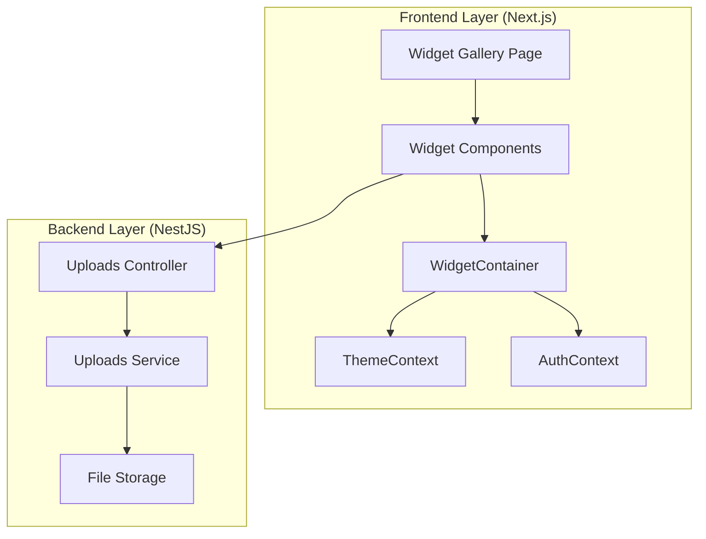

# Design Document

## Overview

The Widget System provides a comprehensive library of 40+ reusable React components designed for building rich dashboard interfaces. The system is architected in three layers:

1. **Component Layer**: React components built on shadcn/ui and Radix UI primitives
2. **Integration Layer**: Theme system integration via CSS custom properties and permission system integration via auth context
3. **Backend Layer**: File upload endpoints for widgets requiring server-side processing

The design emphasizes:
- **Theme Integration**: Automatic adaptation to OKLCH color tokens and typography settings
- **Permission Control**: Component-level access control using JWT permissions
- **Type Safety**: Comprehensive TypeScript types for all components
- **Performance**: Optimized rendering with memoization, virtualization, and lazy loading
- **Accessibility**: WCAG AA compliance with proper ARIA attributes and keyboard navigation

## Architecture

### System Architecture Diagram



### Component Hierarchy

```
WidgetContainer (wrapper)
├── Permission Check (via PermissionGuard)
├── Loading State (SkeletonLoader)
├── Error State (ErrorBoundary)
└── Widget Content
    ├── Theme-aware styling (CSS variables)
    ├── Responsive layout (Tailwind breakpoints)
    └── Interactive elements (event handlers)
```


## Components and Interfaces

### Core Widget Types

#### WidgetContainer

The base wrapper component providing consistent styling and features for all widgets.

```typescript
interface WidgetContainerProps {
  title: string;
  actions?: React.ReactNode;
  loading?: boolean;
  error?: string;
  permission?: string;
  collapsible?: boolean;
  defaultCollapsed?: boolean;
  children: React.ReactNode;
  className?: string;
}
```

**Implementation Details**:
- Uses shadcn/ui Card component for base styling
- Integrates PermissionGuard for access control
- Shows SkeletonLoader when loading=true
- Displays error message with retry button when error is set
- Uses Collapsible from Radix UI when collapsible=true
- Applies theme colors via Tailwind classes (bg-card, text-card-foreground, border-border)

#### StatsCard

Single metric display with icon, value, and trend indicator.

```typescript
interface StatsCardProps {
  title: string;
  value: string | number;
  icon?: LucideIcon;
  trend?: {
    value: number;
    direction: 'up' | 'down';
  };
  color?: string;
  permission?: string;
  loading?: boolean;
  className?: string;
}
```

**Implementation Details**:
- Wraps content in WidgetContainer
- Uses Lucide React icons
- Trend indicator shows percentage with up/down arrow
- Color prop maps to theme tokens (primary, secondary, accent, etc.)
- Responsive text sizing (text-2xl on mobile, text-3xl on desktop)


#### DataTable

Advanced table with search, filter, sort, and pagination using TanStack Table.

```typescript
interface DataTableProps<T> {
  data: T[];
  columns: ColumnDef<T>[];
  actions?: (row: T) => React.ReactNode;
  searchable?: boolean;
  filterable?: boolean;
  pagination?: boolean;
  permission?: string;
  onRowClick?: (row: T) => void;
  loading?: boolean;
  className?: string;
}
```

**Implementation Details**:
- Uses @tanstack/react-table for table logic
- Search input filters across all columns using global filter
- Pagination controls with page size selector (10, 25, 50, 100)
- Column sorting with visual indicators (arrows)
- Row actions rendered in last column
- Responsive: horizontal scroll on mobile, full table on desktop
- Uses shadcn/ui Table component for styling

#### ChartWidget

Wrapper for various chart types using Recharts.

```typescript
interface ChartWidgetProps {
  type: 'line' | 'bar' | 'pie' | 'area' | 'composed';
  data: any[];
  title?: string;
  height?: number;
  config: ChartConfig;
  permission?: string;
  loading?: boolean;
  className?: string;
}

interface ChartConfig {
  xAxisKey?: string;
  yAxisKey?: string;
  dataKeys: string[];
  colors?: string[];
  showLegend?: boolean;
  showTooltip?: boolean;
  showGrid?: boolean;
}
```

**Implementation Details**:
- Uses Recharts library (LineChart, BarChart, PieChart, AreaChart, ComposedChart)
- Colors default to theme chart tokens (chart1-5)
- ResponsiveContainer for automatic sizing
- Tooltip and Legend styled with theme colors
- Lazy loaded using React.lazy to reduce initial bundle size


#### FileUpload

Drag-and-drop file upload component with validation.

```typescript
interface FileUploadProps {
  accept?: string;
  maxSize?: number;
  multiple?: boolean;
  onUpload: (files: File[]) => Promise<void>;
  permission?: string;
  className?: string;
}
```

**Implementation Details**:
- Uses react-dropzone for drag-and-drop functionality
- Visual feedback: border color changes on drag over
- File validation: type (accept prop) and size (maxSize prop)
- Progress indicator during upload
- File list with remove buttons before upload
- Error messages for validation failures
- Calls backend POST /api/uploads endpoint

### Theme Integration

#### CSS Variable Mapping

All widgets use CSS custom properties from the theme system:

```typescript
// Color tokens used by widgets
const themeColors = {
  background: 'var(--background)',
  foreground: 'var(--foreground)',
  card: 'var(--card)',
  cardForeground: 'var(--card-foreground)',
  primary: 'var(--primary)',
  primaryForeground: 'var(--primary-foreground)',
  secondary: 'var(--secondary)',
  secondaryForeground: 'var(--secondary-foreground)',
  muted: 'var(--muted)',
  mutedForeground: 'var(--muted-foreground)',
  accent: 'var(--accent)',
  accentForeground: 'var(--accent-foreground)',
  destructive: 'var(--destructive)',
  destructiveForeground: 'var(--destructive-foreground)',
  border: 'var(--border)',
  input: 'var(--input)',
  ring: 'var(--ring)',
  chart1: 'var(--chart-1)',
  chart2: 'var(--chart-2)',
  chart3: 'var(--chart-3)',
  chart4: 'var(--chart-4)',
  chart5: 'var(--chart-5)',
  radius: 'var(--radius)',
};
```

#### Tailwind Class Usage

Widgets use Tailwind utility classes that reference CSS variables:

```tsx
// Example widget styling
<div className="bg-card text-card-foreground border border-border rounded-lg p-4">
  <h3 className="text-lg font-semibold text-foreground">Title</h3>
  <p className="text-sm text-muted-foreground">Description</p>
  <button className="bg-primary text-primary-foreground hover:bg-primary/90">
    Action
  </button>
</div>
```


### Permission Integration

#### Permission Guard Pattern

All widgets support optional permission-based rendering:

```tsx
// Internal implementation in WidgetContainer
import { PermissionGuard } from '@/components/auth/PermissionGuard';

function WidgetContainer({ permission, children, ...props }: WidgetContainerProps) {
  const content = (
    <Card className="...">
      {/* Widget content */}
      {children}
    </Card>
  );
  
  if (permission) {
    return (
      <PermissionGuard permission={permission} fallback={null}>
        {content}
      </PermissionGuard>
    );
  }
  
  return content;
}
```

#### Usage Example

```tsx
// Widget with permission check
<StatsCard
  title="Total Revenue"
  value="$45,678"
  icon={DollarSign}
  permission="analytics:read"
/>

// Widget without permission (visible to all authenticated users)
<StatsCard
  title="Welcome"
  value="Dashboard"
  icon={Home}
/>
```

### Widget Gallery Page

#### Route and Access Control

```tsx
// frontend/src/app/dashboard/widgets/page.tsx
import { PermissionGuard } from '@/components/auth/PermissionGuard';

export default function WidgetGalleryPage() {
  return (
    <PermissionGuard permission="widgets:admin">
      <div className="container mx-auto py-8">
        <h1 className="text-3xl font-bold mb-8">Widget Gallery</h1>
        {/* Widget categories and examples */}
      </div>
    </PermissionGuard>
  );
}
```

#### Gallery Structure

```typescript
interface WidgetExample {
  name: string;
  description: string;
  component: React.ComponentType;
  code: string;
  category: WidgetCategory;
}

type WidgetCategory = 
  | 'core'
  | 'data-display'
  | 'interactive'
  | 'layout'
  | 'forms'
  | 'utility'
  | 'advanced'
  | 'specialized';

const widgetExamples: WidgetExample[] = [
  {
    name: 'StatsCard',
    description: 'Single metric display with icon and trend',
    component: StatsCardExample,
    code: `<StatsCard
  title="Total Users"
  value={1234}
  icon={Users}
  trend={{ value: 12, direction: 'up' }}
/>`,
    category: 'core',
  },
  // ... more examples
];
```


## Data Models

### Widget Type Definitions

```typescript
// frontend/src/components/widgets/types/widget.types.ts

// Base props shared by all widgets
export interface BaseWidgetProps {
  loading?: boolean;
  error?: string;
  permission?: string;
  className?: string;
}

// Stats and metrics
export interface StatItem {
  title: string;
  value: string | number;
  icon?: LucideIcon;
  trend?: TrendData;
  color?: string;
}

export interface TrendData {
  value: number;
  direction: 'up' | 'down';
  period?: string;
}

// Lists and grids
export interface ListItem {
  id: string;
  title: string;
  description?: string;
  icon?: LucideIcon;
  metadata?: Record<string, any>;
}

// Activity and timeline
export interface ActivityItem {
  id: string;
  type: string;
  title: string;
  description?: string;
  timestamp: Date;
  user?: {
    name: string;
    avatar?: string;
  };
  metadata?: Record<string, any>;
}

// Kanban
export interface KanbanColumn {
  id: string;
  title: string;
  items: KanbanItem[];
}

export interface KanbanItem {
  id: string;
  title: string;
  description?: string;
  columnId: string;
  metadata?: Record<string, any>;
}

// Calendar
export interface CalendarEvent {
  id: string;
  title: string;
  start: Date;
  end: Date;
  allDay?: boolean;
  color?: string;
  metadata?: Record<string, any>;
}

// Tree
export interface TreeNode {
  id: string;
  label: string;
  children?: TreeNode[];
  icon?: LucideIcon;
  metadata?: Record<string, any>;
}

// Filters
export interface FilterConfig {
  id: string;
  label: string;
  type: 'text' | 'select' | 'date' | 'range';
  options?: FilterOption[];
  defaultValue?: any;
}

export interface FilterOption {
  label: string;
  value: string;
}

export interface FilterState {
  [key: string]: any;
}
```


## Backend Design

### File Upload Module

#### Module Structure

```
backend/src/uploads/
├── uploads.module.ts
├── uploads.controller.ts
├── uploads.service.ts
├── dto/
│   ├── upload-file.dto.ts
│   └── upload-response.dto.ts
└── interfaces/
    └── upload-config.interface.ts
```

#### Upload Configuration

```typescript
// backend/src/uploads/interfaces/upload-config.interface.ts
export interface UploadConfig {
  maxFileSize: number;
  allowedMimeTypes: string[];
  uploadDir: string;
}

export const UPLOAD_CONFIGS = {
  image: {
    maxFileSize: 5 * 1024 * 1024, // 5MB
    allowedMimeTypes: ['image/jpeg', 'image/png', 'image/gif', 'image/webp'],
    uploadDir: 'uploads/images',
  },
  document: {
    maxFileSize: 10 * 1024 * 1024, // 10MB
    allowedMimeTypes: ['application/pdf', 'application/msword', 'application/vnd.openxmlformats-officedocument.wordprocessingml.document'],
    uploadDir: 'uploads/documents',
  },
};
```

#### DTOs

```typescript
// backend/src/uploads/dto/upload-file.dto.ts
import { IsEnum, IsOptional } from 'class-validator';

export class UploadFileDto {
  @IsEnum(['image', 'document'])
  type: 'image' | 'document';
  
  @IsOptional()
  description?: string;
}

// backend/src/uploads/dto/upload-response.dto.ts
export class UploadResponseDto {
  filename: string;
  originalName: string;
  mimetype: string;
  size: number;
  url: string;
  uploadedAt: Date;
}
```

#### Controller

```typescript
// backend/src/uploads/uploads.controller.ts
import { Controller, Post, UseGuards, UseInterceptors, UploadedFile, Body } from '@nestjs/common';
import { FileInterceptor } from '@nestjs/platform-express';
import { JwtAuthGuard } from '../auth/guards/jwt-auth.guard';
import { PermissionsGuard } from '../auth/guards/permissions.guard';
import { Permissions } from '../auth/decorators/permissions.decorator';

@Controller('uploads')
@UseGuards(JwtAuthGuard, PermissionsGuard)
export class UploadsController {
  constructor(private readonly uploadsService: UploadsService) {}
  
  @Post()
  @Permissions('files:write')
  @UseInterceptors(FileInterceptor('file'))
  async uploadFile(
    @UploadedFile() file: Express.Multer.File,
    @Body() dto: UploadFileDto,
  ): Promise<UploadResponseDto> {
    return this.uploadsService.uploadFile(file, dto);
  }
}
```


#### Service

```typescript
// backend/src/uploads/uploads.service.ts
import { Injectable, BadRequestException } from '@nestjs/common';
import { promises as fs } from 'fs';
import { join } from 'path';
import { v4 as uuidv4 } from 'uuid';

@Injectable()
export class UploadsService {
  async uploadFile(
    file: Express.Multer.File,
    dto: UploadFileDto,
  ): Promise<UploadResponseDto> {
    // Validate file
    this.validateFile(file, dto.type);
    
    // Generate unique filename
    const ext = file.originalname.split('.').pop();
    const filename = `${uuidv4()}.${ext}`;
    
    // Get upload directory
    const config = UPLOAD_CONFIGS[dto.type];
    const uploadDir = join(process.cwd(), config.uploadDir);
    
    // Ensure directory exists
    await fs.mkdir(uploadDir, { recursive: true });
    
    // Save file
    const filepath = join(uploadDir, filename);
    await fs.writeFile(filepath, file.buffer);
    
    // Return response
    return {
      filename,
      originalName: file.originalname,
      mimetype: file.mimetype,
      size: file.size,
      url: `/uploads/${dto.type}/${filename}`,
      uploadedAt: new Date(),
    };
  }
  
  private validateFile(file: Express.Multer.File, type: 'image' | 'document'): void {
    const config = UPLOAD_CONFIGS[type];
    
    // Check file size
    if (file.size > config.maxFileSize) {
      throw new BadRequestException(
        `File size exceeds maximum of ${config.maxFileSize / 1024 / 1024}MB`
      );
    }
    
    // Check mime type
    if (!config.allowedMimeTypes.includes(file.mimetype)) {
      throw new BadRequestException(
        `File type ${file.mimetype} is not allowed`
      );
    }
  }
}
```

## Error Handling

### Widget Error States

```typescript
// Error boundary for widgets
class WidgetErrorBoundary extends React.Component<
  { children: React.ReactNode; fallback?: React.ReactNode },
  { hasError: boolean; error?: Error }
> {
  state = { hasError: false, error: undefined };
  
  static getDerivedStateFromError(error: Error) {
    return { hasError: true, error };
  }
  
  componentDidCatch(error: Error, errorInfo: React.ErrorInfo) {
    console.error('Widget error:', error, errorInfo);
  }
  
  render() {
    if (this.state.hasError) {
      return this.props.fallback || (
        <div className="p-4 border border-destructive rounded-lg bg-destructive/10">
          <p className="text-destructive font-semibold">Widget Error</p>
          <p className="text-sm text-muted-foreground">{this.state.error?.message}</p>
        </div>
      );
    }
    
    return this.props.children;
  }
}
```


### Backend Error Handling

```typescript
// File upload errors
export class FileUploadError extends BadRequestException {
  constructor(message: string) {
    super({
      statusCode: 400,
      message: `File upload failed: ${message}`,
      error: 'Bad Request',
    });
  }
}

// Error scenarios
- Invalid file type: 400 with allowed types list
- File too large: 400 with size limit
- Missing permission: 403 Forbidden
- Storage error: 500 Internal Server Error
```

## Testing Strategy

### Frontend Testing

#### Component Tests

```typescript
// StatsCard.test.tsx
describe('StatsCard', () => {
  it('should render title and value', () => {
    render(<StatsCard title="Users" value={100} />);
    expect(screen.getByText('Users')).toBeInTheDocument();
    expect(screen.getByText('100')).toBeInTheDocument();
  });
  
  it('should show trend indicator when provided', () => {
    render(
      <StatsCard
        title="Users"
        value={100}
        trend={{ value: 12, direction: 'up' }}
      />
    );
    expect(screen.getByText('12%')).toBeInTheDocument();
    expect(screen.getByTestId('trend-up-icon')).toBeInTheDocument();
  });
  
  it('should hide when user lacks permission', () => {
    const { container } = render(
      <StatsCard
        title="Users"
        value={100}
        permission="analytics:read"
      />
    );
    // Assuming user doesn't have permission
    expect(container.firstChild).toBeNull();
  });
  
  it('should show skeleton when loading', () => {
    render(<StatsCard title="Users" value={100} loading />);
    expect(screen.getByTestId('skeleton-loader')).toBeInTheDocument();
  });
});
```

#### Integration Tests

```typescript
// WidgetGallery.test.tsx
describe('Widget Gallery Page', () => {
  it('should require widgets:admin permission', () => {
    render(<WidgetGalleryPage />);
    expect(screen.getByText('Access Denied')).toBeInTheDocument();
  });
  
  it('should display all widget categories', () => {
    // Mock user with widgets:admin permission
    render(<WidgetGalleryPage />);
    expect(screen.getByText('Core Widgets')).toBeInTheDocument();
    expect(screen.getByText('Data Display')).toBeInTheDocument();
    expect(screen.getByText('Interactive')).toBeInTheDocument();
  });
  
  it('should show live widget examples', () => {
    render(<WidgetGalleryPage />);
    expect(screen.getByText('StatsCard')).toBeInTheDocument();
    expect(screen.getByText('DataTable')).toBeInTheDocument();
  });
});
```

### Backend Testing

#### Unit Tests

```typescript
// uploads.service.spec.ts
describe('UploadsService', () => {
  it('should upload valid image file', async () => {
    const file = createMockFile('test.jpg', 'image/jpeg', 1024);
    const result = await service.uploadFile(file, { type: 'image' });
    
    expect(result.filename).toBeDefined();
    expect(result.mimetype).toBe('image/jpeg');
    expect(result.url).toContain('/uploads/image/');
  });
  
  it('should reject file exceeding size limit', async () => {
    const file = createMockFile('large.jpg', 'image/jpeg', 10 * 1024 * 1024);
    
    await expect(
      service.uploadFile(file, { type: 'image' })
    ).rejects.toThrow('File size exceeds maximum');
  });
  
  it('should reject invalid file type', async () => {
    const file = createMockFile('test.exe', 'application/x-msdownload', 1024);
    
    await expect(
      service.uploadFile(file, { type: 'image' })
    ).rejects.toThrow('File type');
  });
});
```


#### E2E Tests

```typescript
// uploads.e2e-spec.ts
describe('Uploads API (e2e)', () => {
  it('POST /uploads should upload file with valid permission', () => {
    return request(app.getHttpServer())
      .post('/uploads')
      .set('Authorization', `Bearer ${validToken}`)
      .attach('file', 'test/fixtures/test.jpg')
      .field('type', 'image')
      .expect(201)
      .expect((res) => {
        expect(res.body.filename).toBeDefined();
        expect(res.body.url).toContain('/uploads/image/');
      });
  });
  
  it('POST /uploads should reject without permission', () => {
    return request(app.getHttpServer())
      .post('/uploads')
      .set('Authorization', `Bearer ${tokenWithoutPermission}`)
      .attach('file', 'test/fixtures/test.jpg')
      .field('type', 'image')
      .expect(403);
  });
});
```

## Performance Optimization

### Lazy Loading

```typescript
// Lazy load heavy chart components
const ChartWidget = React.lazy(() => import('./ChartWidget'));
const KanbanBoard = React.lazy(() => import('./KanbanBoard'));

// Usage with Suspense
<Suspense fallback={<SkeletonLoader variant="chart" />}>
  <ChartWidget type="line" data={data} />
</Suspense>
```

### Memoization

```typescript
// Memoize expensive computations
const MemoizedStatsCard = React.memo(StatsCard, (prev, next) => {
  return (
    prev.value === next.value &&
    prev.trend?.value === next.trend?.value &&
    prev.loading === next.loading
  );
});
```

### Virtualization

```typescript
// Use virtual scrolling for large lists
import { useVirtualizer } from '@tanstack/react-virtual';

function VirtualList({ items }: { items: any[] }) {
  const parentRef = React.useRef<HTMLDivElement>(null);
  
  const virtualizer = useVirtualizer({
    count: items.length,
    getScrollElement: () => parentRef.current,
    estimateSize: () => 50,
  });
  
  return (
    <div ref={parentRef} style={{ height: '400px', overflow: 'auto' }}>
      <div style={{ height: `${virtualizer.getTotalSize()}px` }}>
        {virtualizer.getVirtualItems().map((virtualItem) => (
          <div
            key={virtualItem.key}
            style={{
              position: 'absolute',
              top: 0,
              left: 0,
              width: '100%',
              height: `${virtualItem.size}px`,
              transform: `translateY(${virtualItem.start}px)`,
            }}
          >
            {items[virtualItem.index].title}
          </div>
        ))}
      </div>
    </div>
  );
}
```


### Debouncing

```typescript
// Debounce search input
import { useDebouncedCallback } from 'use-debounce';

function SearchBar({ onSearch }: { onSearch: (query: string) => void }) {
  const debouncedSearch = useDebouncedCallback(
    (value: string) => {
      onSearch(value);
    },
    300
  );
  
  return (
    <input
      type="text"
      onChange={(e) => debouncedSearch(e.target.value)}
      placeholder="Search..."
    />
  );
}
```

## Accessibility Implementation

### ARIA Attributes

```tsx
// Example: StatsCard with proper ARIA
<div
  role="region"
  aria-label={`${title} statistics`}
  className="stats-card"
>
  <h3 id="stats-title">{title}</h3>
  <p aria-labelledby="stats-title" className="text-3xl font-bold">
    {value}
  </p>
  {trend && (
    <div
      role="status"
      aria-live="polite"
      aria-label={`Trend: ${trend.direction} ${trend.value} percent`}
    >
      <TrendIcon aria-hidden="true" />
      <span>{trend.value}%</span>
    </div>
  )}
</div>
```

### Keyboard Navigation

```typescript
// Example: Interactive list with keyboard support
function ListWidget({ items, onItemClick }: ListWidgetProps) {
  const handleKeyDown = (e: React.KeyboardEvent, item: ListItem) => {
    if (e.key === 'Enter' || e.key === ' ') {
      e.preventDefault();
      onItemClick?.(item);
    }
  };
  
  return (
    <ul role="list">
      {items.map((item) => (
        <li
          key={item.id}
          role="listitem"
          tabIndex={0}
          onClick={() => onItemClick?.(item)}
          onKeyDown={(e) => handleKeyDown(e, item)}
          className="focus:outline-none focus:ring-2 focus:ring-ring"
        >
          {item.title}
        </li>
      ))}
    </ul>
  );
}
```

### Screen Reader Announcements

```typescript
// Use existing hook for dynamic announcements
import { useScreenReaderAnnouncement } from '@/hooks/useScreenReaderAnnouncement';

function DataTable({ data }: DataTableProps) {
  const { announce } = useScreenReaderAnnouncement();
  
  const handleSort = (column: string) => {
    // Sort logic
    announce(`Table sorted by ${column}`);
  };
  
  const handleFilter = (filterCount: number) => {
    announce(`${filterCount} filters applied. ${data.length} results found.`);
  };
  
  return (
    // Table implementation
  );
}
```

## Security Considerations

### File Upload Security

1. **File Type Validation**: Whitelist allowed MIME types, reject all others
2. **File Size Limits**: Enforce maximum file sizes to prevent DoS
3. **Filename Sanitization**: Use UUIDs instead of user-provided filenames
4. **Storage Isolation**: Store files outside web root, serve via controller
5. **Virus Scanning**: Optional integration with ClamAV for uploaded files
6. **Permission Checks**: Require `files:write` permission for uploads

### XSS Prevention

```typescript
// Sanitize user input in widgets
import DOMPurify from 'dompurify';

function SafeContent({ html }: { html: string }) {
  const sanitized = DOMPurify.sanitize(html);
  return <div dangerouslySetInnerHTML={{ __html: sanitized }} />;
}
```

### Permission Bypass Prevention

```typescript
// Always check permissions on backend, never trust frontend
@Post('upload')
@UseGuards(JwtAuthGuard, PermissionsGuard)
@Permissions('files:write')
async uploadFile() {
  // Backend validates permission before processing
}
```


## Implementation Notes

### File Structure

```
frontend/src/components/widgets/
├── core/
│   ├── StatsCard.tsx
│   ├── StatsGrid.tsx
│   ├── DataTable.tsx
│   ├── ChartWidget.tsx
│   ├── ActivityFeed.tsx
│   └── WidgetContainer.tsx
├── data-display/
│   ├── MetricCard.tsx
│   ├── ProgressWidget.tsx
│   ├── ListWidget.tsx
│   └── CardGrid.tsx
├── interactive/
│   ├── QuickActions.tsx
│   ├── FilterPanel.tsx
│   ├── SearchBar.tsx
│   └── NotificationWidget.tsx
├── layout/
│   ├── PageHeader.tsx
│   ├── EmptyState.tsx
│   ├── ErrorBoundary.tsx
│   └── SkeletonLoader.tsx
├── forms/
│   ├── FormCard.tsx
│   ├── FileUpload.tsx
│   ├── DateRangePicker.tsx
│   └── MultiSelect.tsx
├── utility/
│   ├── Badge.tsx
│   ├── Avatar.tsx
│   ├── Tooltip.tsx
│   └── Modal.tsx
├── advanced/
│   ├── KanbanBoard.tsx
│   ├── Calendar.tsx
│   ├── TreeView.tsx
│   └── Timeline.tsx
├── specialized/
│   ├── UserCard.tsx
│   ├── PricingCard.tsx
│   ├── ComparisonTable.tsx
│   ├── MapWidget.tsx
│   └── ChatWidget.tsx
├── integration/
│   ├── ApiWidget.tsx
│   ├── PermissionWrapper.tsx
│   ├── ThemePreview.tsx
│   ├── ExportButton.tsx
│   └── BulkActions.tsx
├── types/
│   └── widget.types.ts
├── README.md
└── index.ts
```

### Package Installation Order

```bash
# Phase 1: Essential dependencies
cd frontend
npm install recharts date-fns react-day-picker @tanstack/react-virtual react-dropzone

# Phase 2: Radix UI components
npm install @radix-ui/react-tabs @radix-ui/react-tooltip @radix-ui/react-popover @radix-ui/react-accordion @radix-ui/react-collapsible @radix-ui/react-scroll-area

# Phase 3: shadcn/ui components
npx shadcn@latest add badge button card calendar skeleton table tooltip dialog form input command collapsible breadcrumb scroll-area popover toast avatar progress select checkbox

# Phase 4: Optional advanced features
npm install @dnd-kit/core @dnd-kit/sortable @dnd-kit/utilities

# Backend
cd ../backend
npm install @nestjs/platform-express multer
npm install @types/multer -D
```

### Development Workflow

1. **Create Widget Component**: Start with TypeScript interface, implement component with theme classes
2. **Add Permission Support**: Wrap in WidgetContainer with permission prop
3. **Add Loading State**: Implement skeleton loader variant
4. **Add Error Handling**: Wrap in ErrorBoundary
5. **Add to Gallery**: Create example in widget gallery page
6. **Write Tests**: Unit tests for component logic, integration tests for permission checks
7. **Document**: Add JSDoc comments and usage examples

### Theme Token Reference

```typescript
// Quick reference for common theme tokens
const tokens = {
  // Backgrounds
  background: 'bg-background',
  card: 'bg-card',
  muted: 'bg-muted',
  
  // Text
  foreground: 'text-foreground',
  mutedForeground: 'text-muted-foreground',
  
  // Borders
  border: 'border-border',
  
  // Interactive
  primary: 'bg-primary text-primary-foreground',
  secondary: 'bg-secondary text-secondary-foreground',
  destructive: 'bg-destructive text-destructive-foreground',
  
  // Charts
  chart1: 'fill-chart-1',
  chart2: 'fill-chart-2',
  // ... etc
};
```

## Migration Strategy

### Phase 1: Foundation (Week 1)
1. Install all required packages
2. Create type definitions in widget.types.ts
3. Implement WidgetContainer base component
4. Set up widget directory structure

### Phase 2: Core Widgets (Week 2)
1. Implement StatsCard, StatsGrid
2. Implement DataTable with TanStack Table
3. Implement ChartWidget with Recharts
4. Implement ActivityFeed
5. Add tests for core widgets

### Phase 3: Data Display & Interactive (Week 3)
1. Implement MetricCard, ProgressWidget, ListWidget, CardGrid
2. Implement QuickActions, FilterPanel, SearchBar, NotificationWidget
3. Add tests for data display and interactive widgets

### Phase 4: Layout & Forms (Week 4)
1. Implement PageHeader, EmptyState, ErrorBoundary, SkeletonLoader
2. Implement FormCard, FileUpload, DateRangePicker, MultiSelect
3. Set up backend uploads module
4. Add tests for layout and form widgets

### Phase 5: Utility & Advanced (Week 5)
1. Implement Badge, Avatar, Tooltip, Modal (using shadcn/ui)
2. Implement KanbanBoard, Calendar, TreeView, Timeline
3. Add tests for utility and advanced widgets

### Phase 6: Specialized & Integration (Week 6)
1. Implement UserCard, PricingCard, ComparisonTable, MapWidget, ChatWidget
2. Implement ApiWidget, PermissionWrapper, ThemePreview, ExportButton, BulkActions
3. Add tests for specialized and integration widgets

### Phase 7: Widget Gallery & Documentation (Week 7)
1. Create widget gallery page at /dashboard/widgets
2. Add permission "widgets:admin" to seed data
3. Create examples for all widgets
4. Write comprehensive README
5. Final testing and bug fixes

